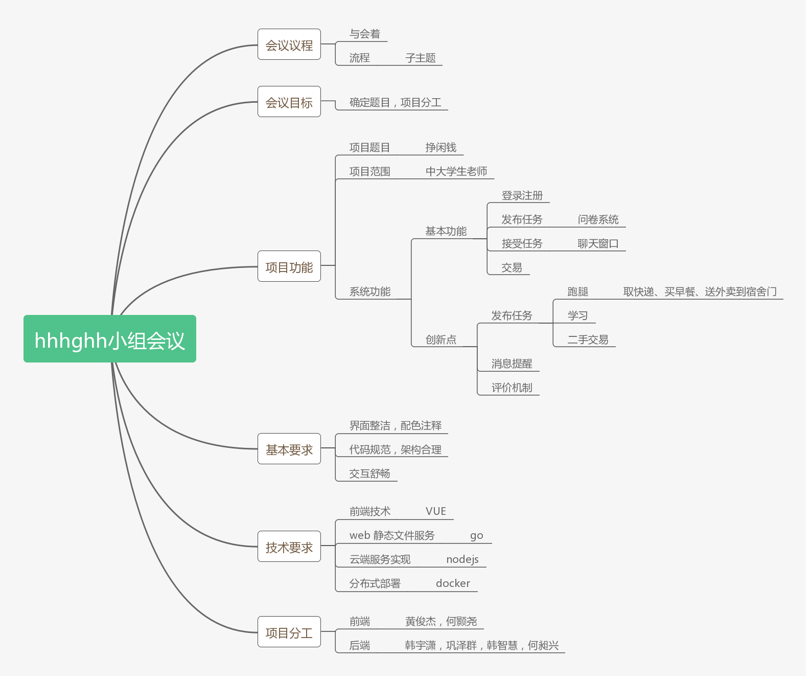
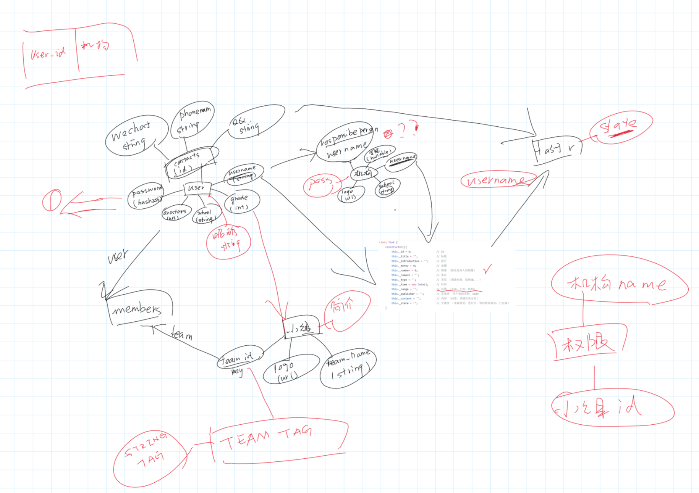
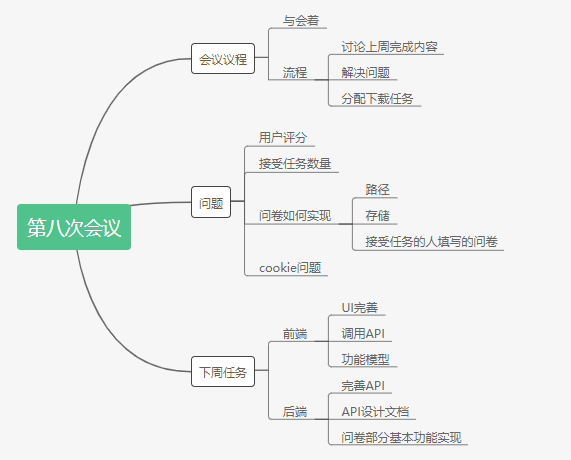
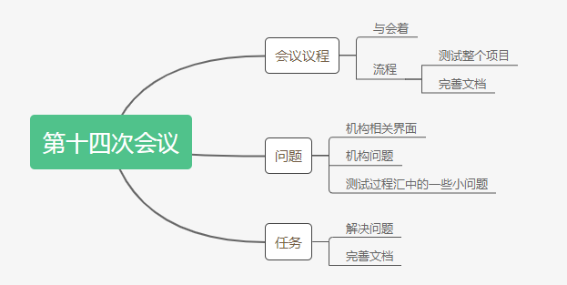

# 1、项目简介
### 挣闲钱
 - 挣闲钱是大学生通过做任务挣钱的云平台，它属于以运营为中心的服务软件，也可以理解为面向大学生的专业“众包”系统。系统非常简单：有一个云服务中心，其业务在不断完善中；每个学生都装有“挣闲钱”客户端；一些机构，称为“奶牛”，他们提供任务给平台。基本业务是，奶牛发布任务要求与薪酬，系统推送到客户端，学生完成任务可获得系统内部的“闲钱币”，“闲钱币”可用于发布任务或提现。系统不支持零元交易。
 - 挣闲钱系统包括是用户管理系统、任务管理系统、交易管理系统等，特别合适采用面向服务的架构实现。系统的难点在于运营，即任务（业务）的发现与投放。
 - 基本假设：所有学生通过账号密码登陆；学生注册的学号、姓名、年龄、性别、年级、专业等信息是真实的。学生平时使用昵称、头像在社区中活动，可以自由组成兴趣组。机构信息都是真实有效的。
 - 任务场景：
    - 机构组织问卷调查。如学生会针对大二，女生就某个问题开展调查，共300份，符合条件学生完成调查就可得到一元闲钱。
     -	协会招新通知。如某协会正对计算机大一新生征集简历，填写提交简历可得到0.01元闲钱。
      -	跑腿。如某学生出 0.5 元闲钱请同专业同年级取快递。
      -	学习。如某学生出 5 元闲钱请同专业同年级辅导学习。
      -	二手交易。如某学生在挣闲钱上出售二手书籍。

---

# 2、重要分析设计文档
+ Requirement specification（需求规格说明书）
  + [Usecase Diagram and UML Activity Diagram（用例图，业务过程/多泳道图）](https://hhhghh.github.io/Dashboard/06-01-usecase-diagram)            
  + [Use Cases（用例+活动图）](https://hhhghh.github.io/Dashboard/06-02-use-cases)       
  + [Domian Models（领域模型）](https://hhhghh.github.io/Dashboard/06-03-domian_model)
  + [State Models（状态模型）](https://hhhghh.github.io/Dashboard/06-04-state_model)
  + [System Sequence Diagrams（功能模型）](https://hhhghh.github.io/Dashboard/06-05-system-sequence-diagrams)
  + [Supplementary Requirements（补充需求）](https://hhhghh.github.io/Dashboard/06-06-supplementary-requirements)
+ Design（设计说明书）
  + [UI design（界面设计）](https://hhhghh.github.io/Dashboard/07-01-UI-design-prototype)
  + [Database design（数据库设计）](https://hhhghh.github.io/Dashboard/07-02-Database-design)
  + [Interface API design（接口 API 设计）](https://hhhghh.github.io/API-document/public)
  + [Architecture design（架构设计）](https://hhhghh.github.io/Dashboard/07-04-software-architecture)
  + [Usecase design（用例设计）]()

---

# 3、敏捷开发迭代管理与大事纪             
### Week4  - 2019/3/19

**会议目标**： 确定项目的功能以及项目分工

**会议时间**： 2019年3月19日

**会议人员**： 韩宇潇、何颢尧、韩智慧、何昶兴、巩泽群、黄俊杰

**会议时间**： 1.5小时

**会议结果**：

**本周目标**：学习框架的使用，配置开发环境，思考项目的需求

---

## 第一次迭代会议

---

### Week5 - 2019/3/26

**会议目标**： 确定项目的具体功能以及功能实现

**会议时间**： 2019年3月26日

**会议人员**： 韩宇潇、何颢尧、韩智慧、何昶兴、巩泽群、黄俊杰

**会议时间**： 2小时

**会议结果**：基本定义项目所需实现的功能，画出 Usecase Diagram

- 用例图第一版：

**本周目标**：

 - 前端： 
    - 初步的UI设计 
    - 基本的API设计
 - 后端：
   - 细化前端的设计 
   - 数据库，给出初步的ER图 
   - 模块分解，给出初步的模块间的接口设计

---

### Week6 - 2019/4/2

**会议目标**：细化项目的数据库设计，细化功能设计

**会议时间**： 2019年4月2日

**会议人员**： 韩宇潇、何颢尧、韩智慧、何昶兴、巩泽群、黄俊杰

**会议时间**： 2小时

**会议结果**：细化数据库设计，在原数据库基础上增加了多个表，明确了数据库表间的联系。讨论具体内容的实现，例如对机构进行设计。

- 机构：（只能向有权限的小组发任务）
    - 有几个公共的小组（大一，大二，大三。。）
    - 机构自己建立一个小组（类似公众号）
    - 可以向小组发申请，经过同意，可以向小组发任务
- 设计数据库草图

**本周目标**：

- 后端团队：
    -  完善数据库
    -  用户及权限系统数据库设计
    -  数据库ER模型图
    -  项目前期调研/竞品分析， 项目愿景， 团队组建与分工

- 前端团队：
    - 页面跳转图，
    - 用例图，
    - 设计UI
    - Use Cases 用例+活动图

---

### Week7 - 2019/4/9

**会议目标**：细化功能设计，对上周设计的用例图，用例+活动图，页面跳转图进行进一步分析

**会议时间**： 2019年4月9日

**会议人员**： 韩宇潇、何颢尧、韩智慧、何昶兴、巩泽群、黄俊杰

**会议时间**： 1.5小时

**会议结果**：细化功能设计，经过会议讨论完善了各种设计的问题。

- 细化用户部分用例图：取消管理员，增加邀请用户功能，修改认证和验证后的跳转界面
- 细化任务部分用例图：预支付，取消任务的解决方案（接受任务的人取消，发布任务的人取消），任务超时）处理（发任务的人两确认方式）
- 细化界面跳转图，添加机构部分

**本周目标**：

- 后端：
  - 文档完善		hzh0，hhyx
  - 数据库连接	GZQ
  - 数据库增删改查	hzh0（用户），hhyx（任务）

- 前端：
  - 文档完善		HeChX，Huang-Junjie，Howlyao
  - 网页设计         HeChX（小组管理），Huang-Junjie（登录，注册），Howlyao（任务）

---
## 第二次迭代会议
---
### Week8 - 2019/4/16

**会议目标**：细化分工，细化功能设计的问题

**会议时间**： 2019年4月16日

**会议人员**： 韩宇潇、何颢尧、韩智慧、何昶兴、巩泽群、黄俊杰

**会议时间**： 1.3小时

**会议结果**：

- 细化分工，按照任务、小组、用户，对每个人进行分工
- 细化功能设计的问题，在数据库上增加两个表

**本周目标**：

- 后端：
  - 实现API功能
  - 完善API设计文档

- 前端：
  - 基本API设计
  - 完善用例活动图，领域模型
  - 完善UI

----

### Week9 - 2019/4/23

**会议目标**：解决问题，

**会议时间**： 2019年4月23日

**会议人员**： 韩宇潇、何颢尧、韩智慧、何昶兴、巩泽群、黄俊杰

**会议时间**： 1小时15分钟

**上周任务汇报：**

1. huang-junjue：

   API需求已完成，UI完善，use-case完善6-01，6-02部分，领域模型待完成

2. hchx：

   API需求已完成，UI完善，领域模型完成

3. howlyao：

   API需求已完成，UI完善，领域模型完成

4. hyx：

   API设计文档完成，API接口实现完成

5. hzh0：

   API设计文档完成，API接口基本实现

   > 需求貌似不明确，还待考虑

6. Gongzq5：

   API设计文档完成，API接口实现未完成

**本周讨论：**

* **需求讨论**
  1. 获得用户信息
  2. 根据用户查询任务
  3. 头像部分，默认头像的设计

* **实现**  

  1. 后端的SESSION、Cookie部分
  2. 图片的存储，逻辑

**下周任务讨论**

1. 整理API文档，汇总
2. Huang-Junjie 增加User部分的API文档需求
3. 前端做一个可以跳来跳去的页面
4. 后端实现API，静态文件服务器

**Further Feature：**

- 拉黑
  - 用户拉黑其他用户，**举报** 之类的什么东西，点在头像上
- 由上 -> 根据人的搜索
- 评论系统

**今日总结**

恭喜我们已经是个成熟的小组了

----

### Week10 - 2019/4/30

**会议目标**：解决问题，

**会议时间**： 2019年4月30日

**会议人员**： 韩宇潇、何颢尧、韩智慧、何昶兴、巩泽群、黄俊杰

**会议时间**： 1小时15分钟

**上周任务汇报：**

1. Huang-Junjue：

   API需求继续完善，UI继续完善，领域模型待黑没有完成

2. HeChx：

   UI完善

3. Howlyao：

   UI完善

4. hhyx：

   API设计文档完成小组部分，实现静态文件服务

5. hzh0：

   用户API接口基本实现

6. Gongzq5：

   任务API接口实现

**下周任务讨论**

1. 整理API文档，汇总，添加了一些新的用户部分API
2. 前端进行合并
3. 后端进行合并

----

### Week11 - 2019/5/7

**会议目标**：解决问题

**会议时间**： 2019年5月7日

**会议人员**： 韩宇潇、何颢尧、韩智慧、何昶兴、巩泽群、黄俊杰

**会议时间**： 1小时15分钟

**会议记录**

----

### Week12 - 2019/5/14

**会议目标**：解决问题

**会议时间**： 2019年5月14日

**会议人员**： 韩宇潇、何颢尧、韩智慧、何昶兴、巩泽群、黄俊杰

**会议时间**： 1小时

**会议记录**

---

## 第三次迭代会议
---
### Week13 - 2019/5/21

**会议目标**：解决问题

**会议时间**： 2019年5月21日

**会议人员**： 韩宇潇、何颢尧、韩智慧、何昶兴、巩泽群、黄俊杰

**会议时间**： 1.5小时

**会议记录**

----

### Week14 - 2019/5/28

**会议目标**：解决问题

**会议时间**： 2019年5月28日

**会议人员**： 韩宇潇、何颢尧、韩智慧、何昶兴、巩泽群、黄俊杰

**会议时间**： 1小时

**会议记录**

----

### Week15 - 2019/6/4

**会议目标**：解决问题

**会议时间**： 2019年6月4日

**会议人员**： 韩宇潇、何颢尧、韩智慧、何昶兴、巩泽群、黄俊杰

**会议时间**： 1.5小时

**会议记录**

----

### Week16 - 2019/6/11

**会议目标**：解决问题

**会议时间**： 2019年6月11日

**会议人员**： 韩宇潇、何颢尧、韩智慧、何昶兴、巩泽群、黄俊杰

**会议时间**： 1.5小时

**会议记录**

----

### Week17 - 2019/6/18

**会议目标**：解决问题

**会议时间**： 2019年6月18日

**会议人员**： 韩宇潇、何颢尧、韩智慧、何昶兴、巩泽群、黄俊杰

**会议时间**： 1.5小时

**会议记录**：

**会议总结**：项目就快要完工了，最后改一些小问题，完善文档就可以顺利结束了
