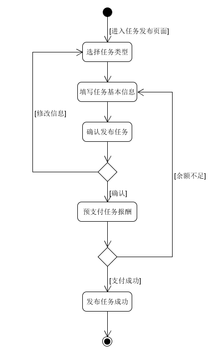
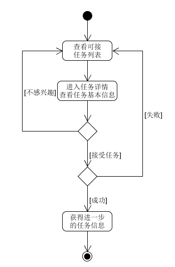
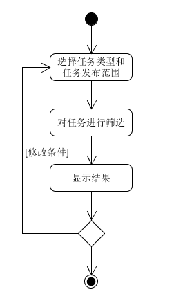
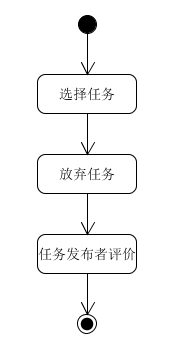
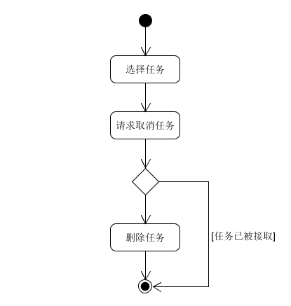
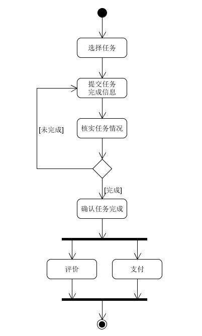
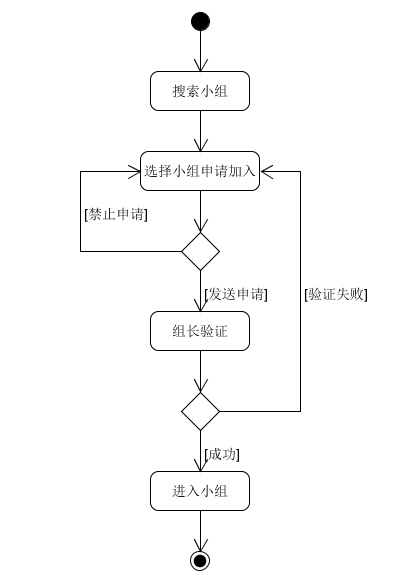
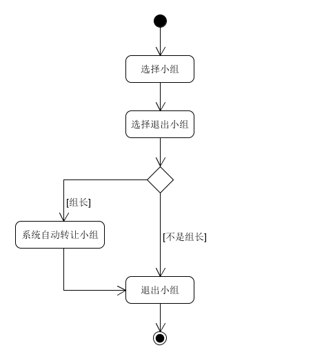

## 摘要用例
1. **搜索小组：** 用户输入小组id，或者组名，或者标签，搜索小组，系统从数据库中筛选符合要求的小组，将小组的基本信息显示。  
2. **创建小组：** 用户进入创建小组页面，填写小组的信息，输入用户id邀请用户，点击创建小组；系统创建一个新的小组，将邀请的用户加入到小组成员表中，更新数据库。  
3. **转让小组：** 用户选择自己是组长的小组，选择小组中的一个其他成员，将小组组长转让给该成员；系统更新小组的组长信息和成员信息。  
4. **解散小组：** 用户选择自己是组长的小组，选择解散小组；系统向该小组的所有成员发送通知，删除小组的所有信息，更新数据库。  
5. **踢出小组：** 用户选择自己是组长的小组，选择小组中的一个其他成员，将该成员移出该小组；系统发送通知给被移出小组的用户，更新小组成员列表，更新数据库。  

## 非正式用例
### 1. 发布任务
主成功场景：  
用户或机构选择要发布的任务类型，填写任务相关的基本的必要的信息，点击发布任务，预支付任务报酬，发布成功后系统记录任务的相关信息。

交替场景：
- 用户预支付任务报酬余额不足时提醒用户，任务发布失败并返回信息填写页面，用户修改任务报酬

活动图  
  

### 2. 查看与接受任务
主成功场景：  
用户在可接任务列表中选择进入任务详情界面查看任务基本信息，并点击接受任务。系统检查并更新任务接受数量额度，记录任务接受者的信息，修改任务的接受者列表信息，更新数据库信息。用户接受任务成功并查看任务的进一步信息。  

交替场景：
- 用户点击接受任务时，系统检查任务接受数量额度已满，用户接受任务失败，弹出提示信息并返回任务列表

活动图  
  

### 3. 搜索任务
主成功场景：  
用户选择任务类型和任务发布范围。系统根据用户选择的任务类型与任务发布范围，从数据库中筛选任务并显示。

交替场景：  
- 如果系统从数据库筛选出来的任务的发布者与用户之间存在屏蔽的关系，则去除该任务，不予显示。
- 如果筛选之后没有能显示的任务，则应显示找不到相关任务并提示用户修改筛选条件。

活动图：  
  

### 4. 放弃任务
主成功场景：  
用户进入已接受任务详情界面，选择放弃任务。系统修改任务接受者列表，更新数据库，将任务重新发布，并发送消息提醒任务发布者。任务发布者对放弃任务的用户进行评价。系统更新放弃任务的用户的个人信誉信息。  

交替场景：  
- 如果任务发布者在规定时间内没有对放弃任务的用户做出评价，则默认扣除放弃任务的用户1点个人信誉值。

活动图：  
  

### 5. 取消任务
主成功场景：  
任务发布者进入已发布任务的任务详情界面，选择取消任务。系统检查任务接受者列表信息，删除该任务信息，将预支付的任务酬金返回至任务发布者账号中，更新数据库。

交替场景：  
- 如果任务已经被其他用户接取，则任务发布者取消任务失败，提醒任务发布者与任务接受者联系沟通（任务接受者放弃任务后便可取消任务）。

活动图：  
  

### 6. 核实与完成任务
主成功场景：  
任务接受者完成任务后，进入任务的详情界面，提交任务完成信息。系统发送信息提醒任务发布者。任务发布者进入该任务的详情界面，查看任务接受者的完成信息，核实情况后，确认任务完成，进行评价打分。系统更新任务状态和任务接受者的个人信誉信息，将任务报酬支付给任务接受者，更新数据库。  

交替场景：  
- 如果任务接受者提交任务完成信息后，任务发布者经过核实发现任务并没有被正确完全完成，则任务发布者应选择任务未完成，任务接受者需继续进行任务。
- 如果在规定时间内任务接受者未能完成任务，系统发送信息通知任务接受者，若任务接受者已经开始了任务且不可逆时，任务接受者需与任务发布者联系沟通并点击完成任务；若任务接受者未完成或在发送通知之后的规定时间内没有选择，则任务失败。系统发送信息通知任务接受者，更新任务状态信息，扣除任务接受者1点个人信誉值，将剩余的预支付的任务报酬退还至任务发布者的账号中，更新数据库。

活动图：  
    

### 7. 申请加入小组
主成功场景：  
用户通过小组id/组名/标签搜索小组，选择小组申请加入，小组组长收到验证消息，验证通过，用户加入到小组当中  

交替场景：  
- 如果小组的进入权限是不需要验证，则用户选择小组申请加入后直接加入到小组当中；  
- 如果小组的进入权限是不允许申请加入，则用户点击申请加入时弹出提示信息；  
- 如果小组组长不同意用户进群，则系统发送信息通知申请者；  

  

### 8. 退出小组
主成功场景：  
用户进入已加入的小组，选择退出小组；系统向小组组长发送通知，更新小组的成员列表，更新数据库。  

交替场景：  
- 如果用户是要退出的小组的组长，则系统自动先将小组组长转让给其他成员（成员列表中第二项的成员），然后再将该用户从小组成员列表中删除。   

  

## 详述用例

**用例名称：** 完成任务  
**范围：** 任务管理系统  
**级别：** 用户级别  
**主要参与者：** 任务发布者、任务接受者
**涉众及其关注点：**  
- 任务发布者：希望任务能按时准确被完成，并且可以对任务接受者进行评价。    
- 任务接受者：希望完成任务后能快速通过审核，并得到正确的酬金。  
**前置条件：** 需要用户登录并且通过认证  
**成功保证：** 更新任务状态；发放酬金；更新用户个人信誉；
**主成功场景：** 
1. 任务接受者完成任务后，进入任务的详情界面，提交任务完成信息；
2. 系统发送信息提醒任务发布者；
3. 任务发布者进入该任务的详情界面，查看任务接受者的完成信息；
4. 任务发布者核实情况，确认任务完成；
5. 任务发布者对任务接受者进行评价打分；
6. 系统发放酬金给任务接受者；
7. 系统更新任务状态和任务接受者的个人信誉信息。  

**扩展：**   

- 1a. 任务接受者在规定时间内没有提交任务完成信息：  
    1. 系统发送信息通知任务接受者；  
        - 1a. 任务接受者已经开始了任务，且不可逆时（如跑腿任务中已经在驿站拿到了快递/已经拿到了外卖，但是还没送到任务发布者手上）：  
            1. 任务接受者在10分钟内与任务发布者联系沟通；  
            2. 任务发布者选择延长任务时间；  
        - 1b. 任务接受者未能完成任务；  
            1. 任务接受者选择任务未完成；  
            2. 系统发送信息通知任务发布者；  
            3. 系统修改任务状态，将剩余任务酬金退还至任务发布者账号中；  
            4. 系统扣除任务接受者的个人信誉值；  
        - 1c. 任务接受者在10分钟之内没有联系任务发布者：  
            1. 系统发送信息通知任务发布者；  
            2. 系统修改任务状态，将剩余任务酬金退还至任务发布者账号中；  
            3. 系统扣除任务接受者的个人信誉值；  
- 3-4a. 任务发布者在规定时间内（比如12小时内）对任务进行核实，或者没有选择是否确认任务完成：  
    1. 系统默认任务接受者完成任务，自动确认任务完成。  
- 4a. 任务发布者经过核实情况，发现任务没有被正确完成：  
    1. 任务发布者选择任务完成审核未通过，并附上原因；  
    2. 系统发送信息通知任务接受者，告知审核未通过的原因，并提示任务接受者继续进行任务。  
- 5a. 任务发布者没有对任务接受者进行评价打分：  
    1. 系统默认提高任务接受者的个人信誉值。  

**特殊需求：**   
- 系统发送的通知应尽可能明显  

**技术和数据变元表：**  
2. 系统通知可以选择发送短信  

**发生频率：** 经常发生  