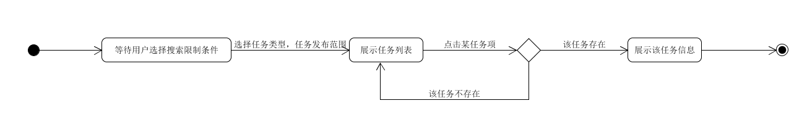
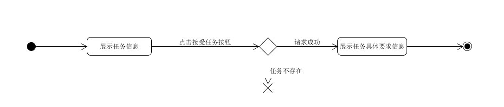
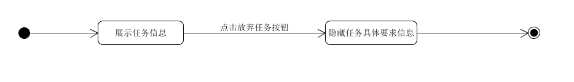
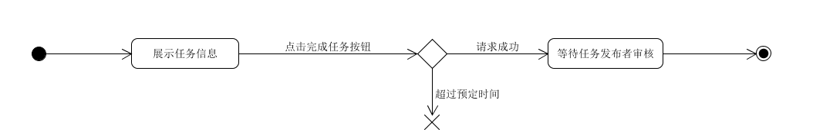
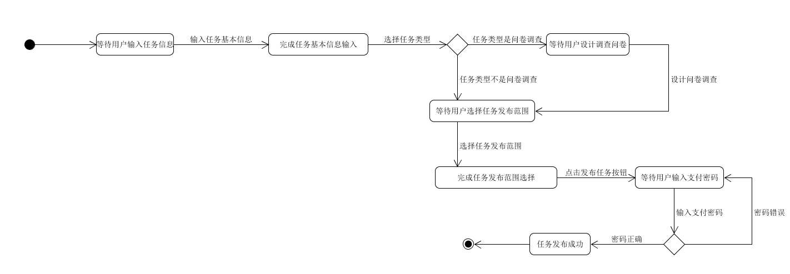
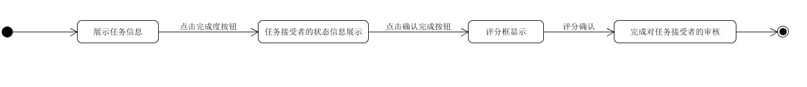
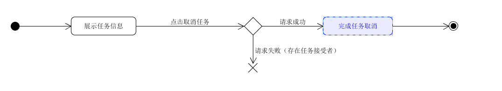

# State Model

版本 | 日期 | 描述 | 作者 |  
:-: | :-: | :-: | :-: |  
v1 | 2019-06-21 | 任务部分状态模型 | Howlyao |  
v2 | 2019-06-23 | 小组部分状态模型 | HeChX |  

## 搜索与展示任务信息

## 接受任务

## 放弃任务

## 完成任务

## 发布任务

## 审核任务

## 取消任务

## 创建小组

## 加入小组

## 退出小组

## 转让小组

## 解散小组

