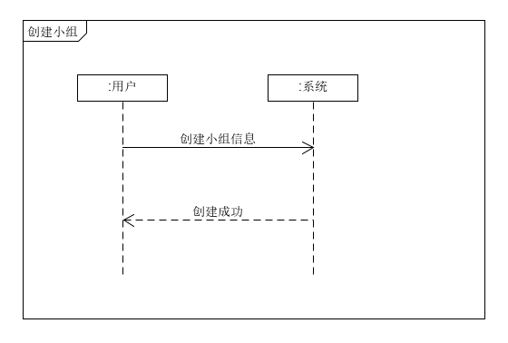
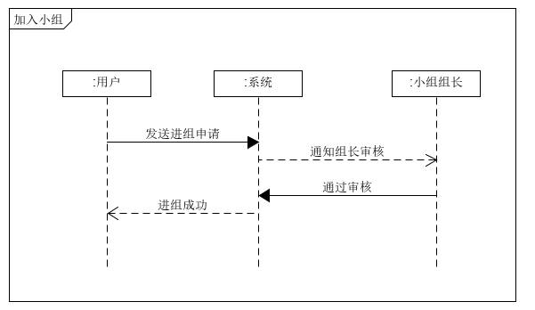
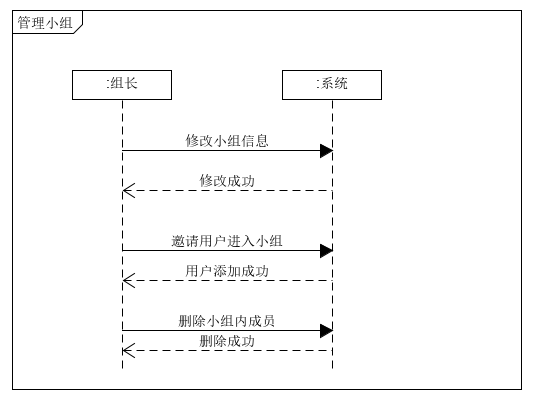
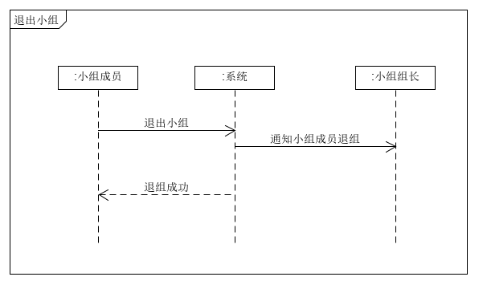
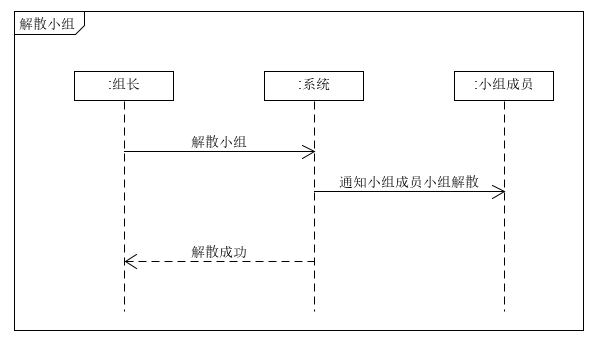

# System Sequence Diagram

---
## 用户

### 用户登录

### 用户注册

### 用户修改个人信息

---
## 小组
### 创建小组

### 加入小组

### 管理小组

### 退出小组

### 解散小组

---

## 任务

### 任务搜索

### 接受任务

### 发布任务

### 完成与核实任务

### 放弃任务

### 取消任务
