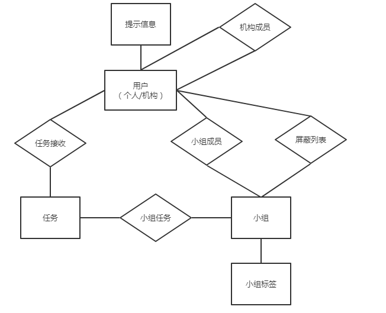
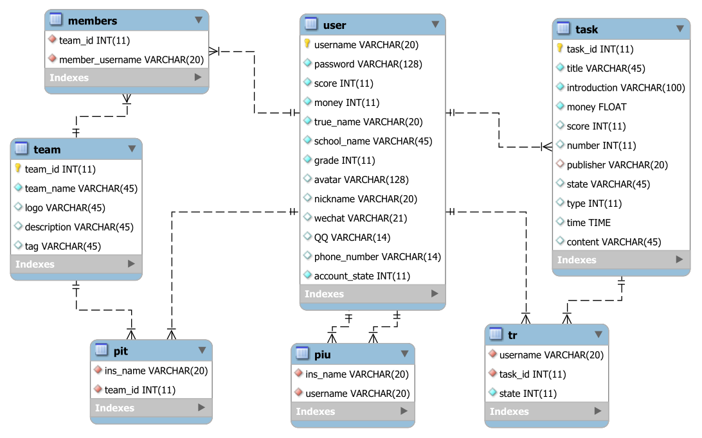

# 数据库设计文档


## 一、技术栈及基本思路

### 1. 技术

* **数据库系统：** 选择使用 **MySQL** 数据库
* **操作系统：** 基于 **Windows server 2012** 系统进行开发
* **ORM框架：** 选用在 github 上拥有18k+ star 的 **ORM** 框架 --- **sequelize**
  * 参考文档：[廖雪峰的教程](<https://www.liaoxuefeng.com/wiki/001434446689867b27157e896e74d51a89c25cc8b43bdb3000/001471955049232be7492e76f514d45a2180e2c224eb7a6000>)，[sequelize的github](<https://github.com/sequelize/sequelize>)


### 2. 基本思路

* 按照面向对象的设计方式抽象数据库的基本结构
* 尽量遵循[第三范式](https://zh.wikipedia.org/wiki/%E7%AC%AC%E4%B8%89%E6%AD%A3%E8%A6%8F%E5%8C%96)，如果遇到性能上的考量，可以增加冗余而提高性能
* 尽量使用基于 **SQL** 的约束，比如 **外键，索引……**


## 二、简要描述

主要的**实体**的表有：

1. 个人/机构用户（**user**）
2. 小组（**team**）
3. 任务（**task**）
4. 小组标签（**teamlabel**）：每个小组的标签
5. 提示信息（**toast**）：用户提示信息


各个表之间的**联系**有：

1. 小组成员 （**member**）：每个小组的成员
2. 机构成员（**organization**）：每个机构的成员
3. 小组任务（**teamtask**）：每个小组内的任务
4. 任务接收表（**tr**）：任务被哪个/些人接受了
5. 屏蔽列表（**pit、piu**）：小组或个人可以选择屏蔽其他用户的任务（小组可以屏蔽机构，个人可以屏蔽机构）


**如图所示**




## 三、数据库ER图

基于以上讨论，我们得到的数据库的 **ER** 图如图所示




## 四、具体说明

### 用户

```mysql
user {
    # 基本要求
    username 		char(20)	primay key,
    password 		Text		not null,
    score			int			not null, 		# 评分
    task_complete 	int, 						# 接受任务的数量
    money 			float		not null, 		# 金钱数量
    
    # 基本信息，实名制的要求
    true_name		char(20) 	not null,		# 真实姓名
    school_name 	char(45)	not null, 		# 学校名
    grade 			int			not null, 		# 年级
    
    # 可选的内容，都是 nullable 的
    avatar 			char(255),	# 头像
    nickname		char(20),	# 昵称
    wechat 			char(21),	# 微信号
    phonenumber 	char(14),	# 联系电话
    QQ 				char(14),	# QQ号
    
    # flags
    account_state	int,		# 个人用户-0/机构用户-1
}
```

### 小组

```mysql
team {
	# 基本要求
	team_id		int			primary key, # 小组ID
	team_name	char(45)	not null,	 # 小组名
	leader		char(20)	not null, 	 # 组长
	
	# 可选内容
	logo		char(255),	# 小组头像
	description	char(100),	# 小组描述
	limit       int,   		# 小组权限 直接进组-0/需要组长审核-1/禁止加入-2
    type		int,        # 小组类型 普通小组-0/默认小组-1
}
```

### 任务

```mysql
task {
	task_id				int			primary key,	# 任务ID
	title				char(45),	# 任务名
	introduction		char(255),	# 任务介绍
	money				float,		# 任务金额
	score				int, 		# 接任务评分要求
	max_accepter_number	int,		# 接受任务人的数量
	publisher			char(20)	foreign key,	# 存发布者的用户名，外键
	state				int，		# 任务状态，完成，进行，等待确认，结束
	type				int,		# 问卷调查-0/跑腿-1
	# 问卷调查 --- 0
	starttime			time, 		# 问卷开始时间
	endtime				time,		# 结束时间
	questionnaire_path	string, 	# 问卷路径
	# 跑腿   --- 1
	content				string,		# 任务详细描述
}
```

### 小组成员

```mysql
members {
	id			int			primary key,	# member ID
	team_id		int			foreign key,	# 小组ID，外键
	username	string 		foreign key,	# 成员名，外键
	
}
```

### 任务接收

```mysql
tr {					# task reciver
	id					int			primary key,	# tr ID
	username			char(20)	foreign key,	# 任务接受人，外键
	task_id				int			foreign key,	# 任务ID，外键
	state				int			# 任务状态，完成，进行……
	score				int			# 任务评分
	questionnaire_path  CHAR(128)	# 填完的问卷路径
}
```

### 权限问题

```mysql
pit { # 决定机构可以向那些小组发送任务 Permission institution to team
	id			int			primary key,	# pit ID
	ins_name	string 		foreign key,	# 机构名，外键
	team_id		int			foreign key,	# 小组ID，外键
}
```
```mysql
piu { # 决定机构不可以向用户发送任务 Permission institution to user
	id			int			primary key,	# piu ID
	ins_name	string 		foreign key,	# 机构名，外键
	username	string 		foreign key,	# 用户名，外键
}
```

### 小组任务之间关系

```mysql
teamtask { # 小组包含的任务
	id			int			primary key,	# teamtask ID
	task_id		int  		foreign key,	# 任务ID，外键
	team_id		int			foreign key,	# 小组ID，外键
	isolate 	bool						# 是否屏蔽
}
```


### 小组标签

```mysql
teamlabel { # 小组标签 Labels for teams
	id			int			primary key,	# teamlabel ID
	team_id		int			foreign key,	# 小组ID，外键
	label		char(45),					# 小组标签 		
}
```

### 提示信息

```mysql
toast { # 提示信息
	id				int			primary key,	# toast ID
	username		char(25),	# 用户名，外键
    type			int,		# 提示信息类型
	message			char(255),	# 提示信息
	msg_username	char(20),	# 提示信息中包含的用户名
	msg_team_id 	int,		# 提示信息中包含的小组ID
	msg_team_name	char(45),	# 提示信息中包含的小组名
	msg_task_id		int,		# 提示信息中包含的任务ID
	msg_task_title  char(45),	# 提示信息中包含的任务名
}
```

### 机构成员
```mysql
organization { # 机构成员
	id				int			primary key,	# organization ID
	ins_name		char(25),	# 机构名，外键
	username		char(25),	# 用户名，外键
}
```