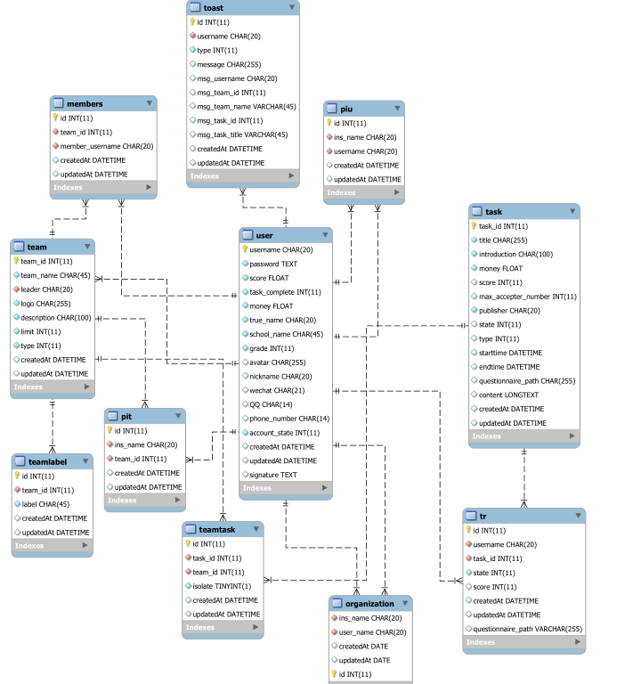

# 数据库设计文档


## 一、技术栈及基本思路

### 1. 技术

* **数据库系统：** 选择使用 **MySQL** 数据库
* **操作系统：** 基于 **Windows server 2012** 系统进行开发
* **ORM框架：** 选用在 github 上拥有18k+ star 的 **ORM** 框架 --- **sequelize**
  * 参考文档：[廖雪峰的教程](<https://www.liaoxuefeng.com/wiki/001434446689867b27157e896e74d51a89c25cc8b43bdb3000/001471955049232be7492e76f514d45a2180e2c224eb7a6000>)，[sequelize的github](<https://github.com/sequelize/sequelize>)


### 2. 基本思路

* 按照面向对象的设计方式抽象数据库的基本结构
* 尽量遵循[第三范式](https://zh.wikipedia.org/wiki/%E7%AC%AC%E4%B8%89%E6%AD%A3%E8%A6%8F%E5%8C%96)，如果遇到性能上的考量，可以增加冗余而提高性能
* 尽量使用基于 **SQL** 的约束，比如 **外键，索引……**


## 二、简要描述

主要的**实体**的表有：

1. 个人/机构用户
2. 兴趣小组
3. 发布的任务


各个表之间的**联系**有：

1. 小组成员：每个小组的成员需要记录
2. 任务接收表：任务被哪个/些人接受了，需要记录
3. 屏蔽列表：小组或个人可以选择屏蔽 其他用户的任务（小组可以屏蔽机构，个人可以屏蔽机构）


**如图所示**


## 三、数据库ER图

基于以上的初步讨论，我们得到的数据库的 **ER** 图如图所示




## 四、具体说明

### 用户

```mysql
user {
    # 基本要求
    username 	char20 		primay key,
    password 	hash256 	not null,
    score		int, 		# 评分
    task_complete int, 		# 接受任务的数量
    money 		float, 		# 机构
    
    # 基本信息，实名制的要求
    true_name	char,		# 具体设置还要再考虑
    school 		char/int, 	# 编号或者学校名，可以使用对照表
    grade 		int, 		# 编号，有对照表
    
    # 可选的内容，都是 nullable 的
    avatar 		image-url 	default '0.0.0.0:8000/images/default.png',
    nickname	char,		default = username
    wechat 		char21,
    phonenumber char14,
    QQ 			char12,
    
    # flags
    account_state	int		default 0,	# 0 代表 个人用户
    									# 1 代表 机构用户
    									# etc...
}
```


### 小组

```mysql
team {
	# 基本要求
	team_id		int			primary key,
	team_name	string		not null,
	leader		string 		not null, # 组长
	# to-do
	# 实名制信息
	# school		...
	# ......
	# 等待后端设计中
	
	# 可选内容
	logo		image-url	default '0.0.0.0:8000/images/default.png',
	description	string,		# 小组描述
	limit       int   		# 小组权限 直接进组-0/需要组长审核-1/禁止加入-2
}
```


### 任务

```mysql
task {
	task_id				int			primary key,
	title				string,
	intro				string,
	money				float,
	number				int,		# 接受任务人的数量，待考量，会造成依赖和不一致的情况
	publisher			string,		foreign key,
							# 存发布者的用户名，外键
	state				string		# 任务状态，完成，进行……（任务发布者决定任务完成情况）
	score				int, 		# 接任务评分要求
	
	type				int,		# 调查？取快递？按编号表来排
	# 问卷调查 --- 0
	endtime				time,		# 结束时间
	starttime			time, 		# 问卷开始时间
	questionnaire_path	string, 	# 问卷路径
	# 取快递   --- 1
	content				string,		# 任务描述（快递密码，具体位置，联系方式）
}
```


### 成员

```mysql
members {
	username	string 		foreign key,
	team_id		int			foreign key
}
```


### 任务接收

```mysql
tr {	# stand for task reciver
	# tr_id		# 是否需要一个 id 来标识，待考虑
	
	username	string		foreign key,
	task_id		int			foreign key,
	state		int			# 任务状态，完成，进行……（表示当前接受者完成情况）
	score		int			# 任务评分
}
```


### 权限问题

```mysql
pit { # 决定机构可以向那些小组发送任务 Permission institution to team
	ins_name	string 		foreign key,
	team_id		int			foreign key
}
```
```mysql
piu { # 决定机构不可以向用户发送任务 Permission institution to user
	ins_name	string 		foreign key,
	username	string 		foreign key,
}
```

### 小组任务之间关系

```mysql
teamtask { # 小组包含的任务
	task_id		int  		foreign key,
	team_id		int			foreign key,
	isolate 	bool		# 是否屏蔽
}
```


### 小组标签

```mysql
teamlabel { # 小组标签 Labels for teams
	team_id		int			foreign key,
	label		string 		
}
```
