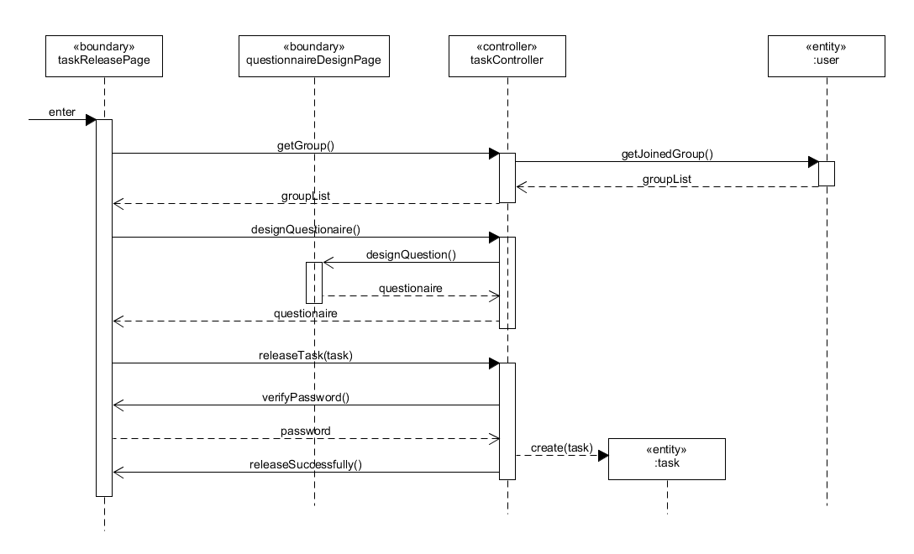
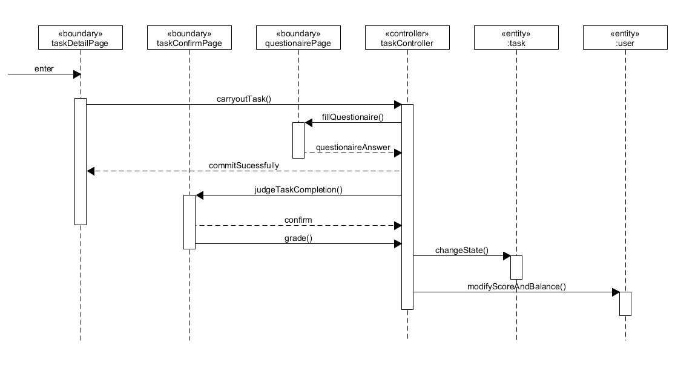
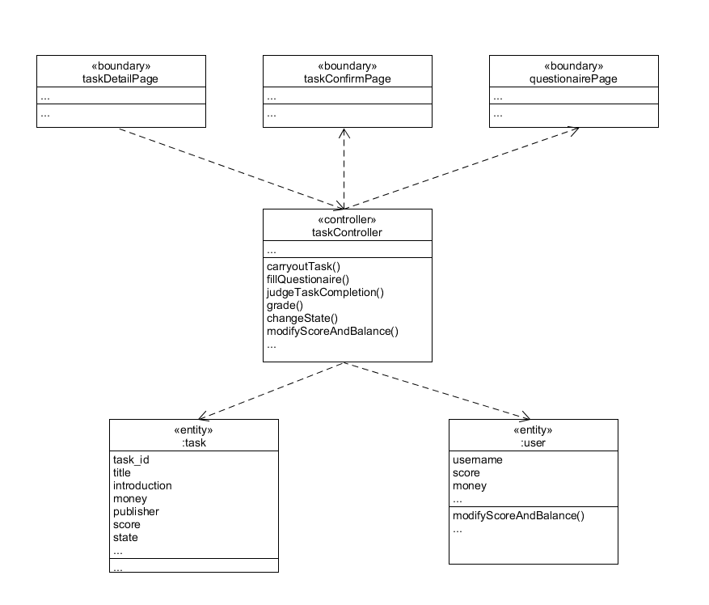

# 用例设计

版本 | 日期 | 描述 | 作者 |  
:-: | :-: | :-: | :-: |  
v1.1 | 2019-06-22 | draft | HeChX |  

## 发布任务用例
**用例简介：** 用户在可接任务列表中选择进入任务详情界面查看任务基本信息，并点击接受任务。系统检查并更新任务接受数量额度，记录任务接受者的信息，修改任务的接受者列表信息，更新数据库信息。用户接受任务成功并查看任务的进一步信息。

**顺序图：**   
  

**类图：**   
  

## 完成任务用例
**用例简介：** 任务接受者完成任务后，进入任务的详情界面，提交任务完成信息。系统发送信息提醒任务发布者。任务发布者进入该任务的详情界面，查看任务接受者的完成信息，核实情况后，确认任务完成，进行评价打分。系统更新任务状态和任务接受者的个人信誉信息，将任务报酬支付给任务接受者，更新数据库。 

**顺序图：**   
  

**类图：**   
  