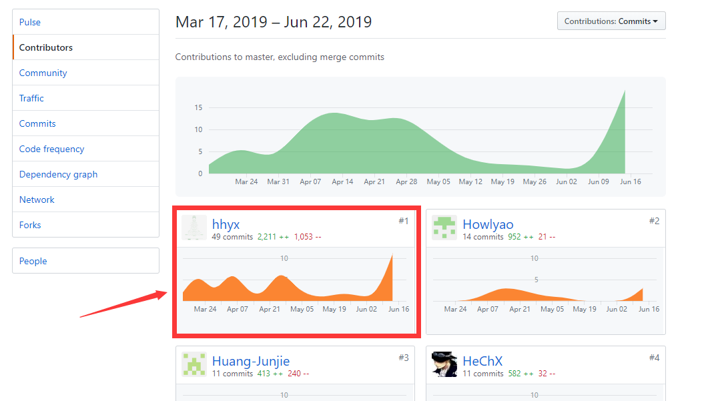
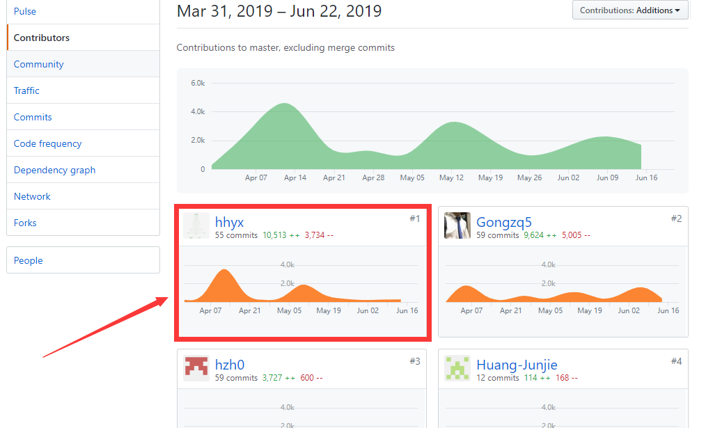
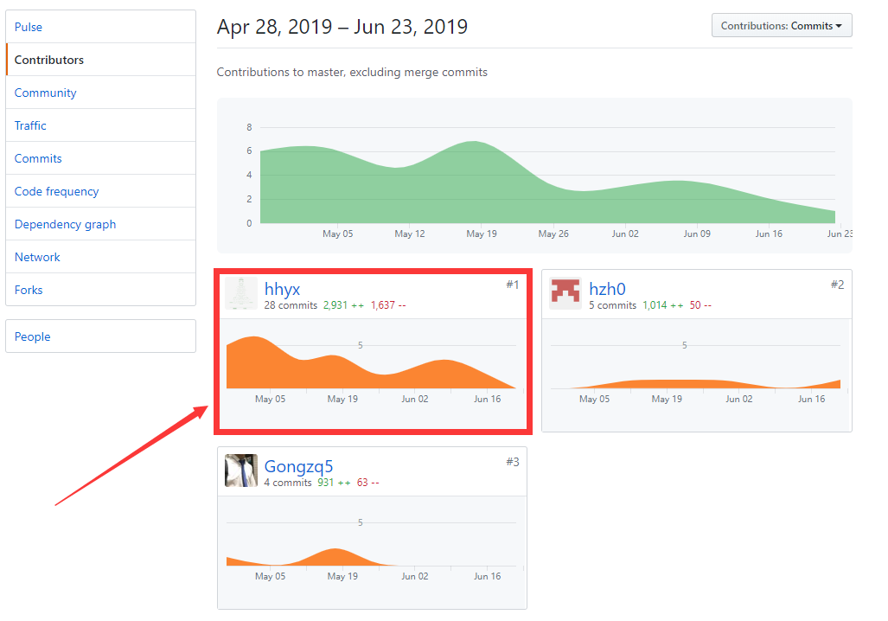

# 16340069 hhyx Final Report

## 个人简短小结
作为团队产品经理和后端成员，我主要工作是后台数据库建立、实现部分后端API、确定需求、管理团队。总的来说，我觉得我在团队中最重要的贡献是把所有成员都串联起来。我们的团队坚持了连续14周的开发，每周都坚持开例会，使我们的项目得以连续的进展。下面分项介绍我在项目完成的内容。
- 调动组内所有成员，保证连续的开发节奏。具体参考[项目看板](https://github.com/hhhghh/Dashboard/projects?query=is%3Aclosed)
- 保证前后端的沟通，保证连接的顺畅。具体体现在[API文档](https://hhhghh.github.io/API-document/public)
- 为组内成员分配合理的工作，很早的让前后端分离。具体参考[团队组建与分工](https://hhhghh.github.io/Dashboard/02-Team-profile)
- 在开会中及时发现各种问题，并讨论解决方案，及时修改。具体参考[会议记录](https://hhhghh.github.io/Dashboard/X1-inception-meeting)
- 服务器基本环境的搭建
- 后端API功能实现

## PSP 2.1 统计

| PSP阶段| 	耗时(h)|
| --- | --- |
| **计划**	|4|
|· 估计任务时间|	4|
|**开发**| 56 |
|· 分析需求|	5|
|· 生成设计文档|3|
|· 设计复审	|2|
|· 代码规范| 1 |
|· 具体设计| 3 |
|· 具体编码	|30|
|· 代码复审	| 2       |
|· 测试	|10|
|**报告**|	5|
|·测试报告|	1|
|·计算工作量	|1|
|事后总结，提出过程改进计划	|3|
|合计	|65|

## 主要工作清单
  - **最有价值**：在我的管理下我们的团队沟通有效，开发有条不紊。这个说起来容易做起来难，我们始终坚持每周开发，每周全体成员都有一定贡献。

## 在项目相关仓库中的贡献，仅需要截图

### Dashboard 文档

### Happy spare money 后端

### API 文档仓库

> API文档是基于swagger的

## 个人博客清单

- [16340069-Sequelize 使用](https://blog.csdn.net/qq_36159989/article/details/93380959)

## 特别致谢

  - 感谢团队中所有的成员，缺少了任何一个人都无法完成这个项目：
	- 16340070-hzh0
	- 16340071-HeChX
	- 16340072-Howlyao
	- 16340063-Gongzq5
	- 16340081-Huang-Junjie
