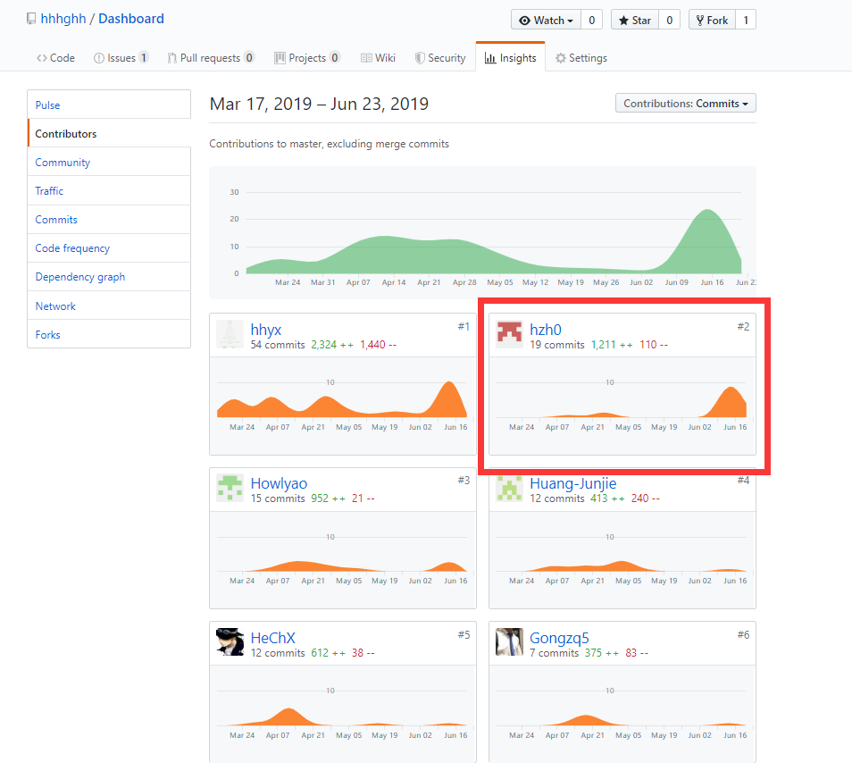
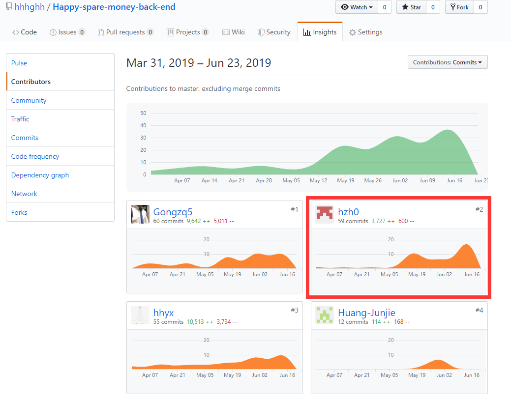

# Final Report
|学号|github id|                       
|---|---|                      
|16340070|hzh0|                  

## 个人简短小结
主要作为后端用户系统部分的开发，同时也需要为项目做项目的前期调研和竞品分析，同时也在项目的需求和分析中与大家一同讨论和实现。
+ 项目前期调研和竞品分析。具体[参见文档](https://hhhghh.github.io/Dashboard/03-Investigation)
+ 后端用户和机构部分的API功能及实现。
+ 与Huang-Junjie同学一起完成身份验证，使用cookies和session完成。
+ 项目文档的书写和项目的需求分析和功能的讨论及实现。                    

## PSP 2.1 统计
| PSP阶段| 耗时(h)|
| --- | --- |
| **计划**	|5|
|· 估计任务时间|5|
|**开发**| 66 |
|· 分析需求|5|
|· 生成设计文档|4|
|· 设计复审	|1|
|· 代码规范| 1 |
|· 具体设计| 5 |
|· 具体编码	|30|
|· 代码复审	| 5 |
|· 测试	|15|
|**报告**|13|
|·测试报告|	2|
|·各类报告文档的书写|3|
|·周会议之后总结本周问题|3|
|·项目前期文档的书写|5|
|合计|84|                   

## 最得意/或有价值/或有苦劳的工作清单
能够每周都有新的贡献输出，每周都能参与组会并参加讨论，感觉与从前相比进步了很多。                 

## 在项目相关仓库中的贡献
### Dashboard 文档集合   
             
### 后端代码仓库
              

             
## 个人博客清单
 + [关于图片存储和更新](https://hhhghh.github.io/Dashboard/16340070-hzh0-tech-report)             

## 特别致谢
项目是终于还算满意的完成了，组内的成员每一周都能都有贡献，推进项目的进行。一个成功的项目离不开组内任何一名成员的鼓励付出，所以在这里致谢每一位辛勤工作的组员：
+ 16340069-hhyx
    - 最辛苦的组长，起到了串联小组成员的重要作用，每周都要写会议总结等一些繁琐的工作
+ 16340071-HeChX
    - 辛勤工作的前端工程师
+ 16340072-Howlyao
    - 前端页面的主要设计者，搭起了前端的页面框架
+ 16340063-Gongzq5
    - 后端工程师，搭建了后端的框架，完成了十分复杂的任务部分的设计与实现
+ 16340081-Huang-Junjie
    - 虽然是主要负责前端。但对身份验证部分做出了大部分的贡献，对待任务十分认真，与其合作完成用户部分的前后端工作十分愉快。