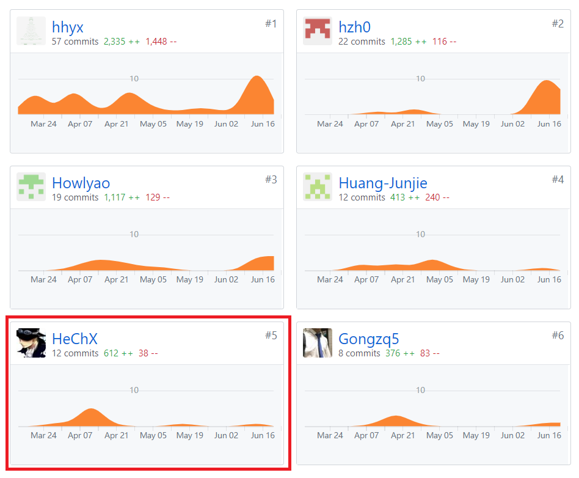

# 16340071 HeChX Final Report
## 个人简短小结  
我主要负责的是小组模块的前端的开发，此外也和小组成员一起开会讨论分析项目的需求和设计，并编写了相关的需求和设计文档。  
- 编写了小组模块的用例、用例图、活动图、状态模型、领域模型等；  
- 小组部分的UI设计；  
- 用例的详细设计；  
- 前端小组部分的页面实现与api调用；  

## PSP 2.1统计

|           PSP阶段          | 耗时(h) |  
|:--------------------------|---------|  
| **计划**                       | **8**       |  
| 估计任务时间                | 8       |  
| **开发**                       | **70**      |  
| 编写分析需求文档                 | 12       |  
| 编写设计文档              | 6       |  
| 设计复审                  | 1       |  
| 代码规范                 | 1       |  
| 编码                     | 36      |  
| 代码复审                 | 2       |  
| 测试                     | 12      |  
| **报告**                   | **7**      |  
| 测试报告                  | 2       |  
| 计算工作量                | 1       |  
| 个人总结                  | 4       |  
| 合计                       | 85      |  

## 主要工作清单
最得意：分析项目的需求并编写了大部分需求用例  

## 在项目相关仓库中的贡献截图
Dashboard仓库贡献截图  
  
前端贡献截图  
  

## 个人博客清单
[Vue+axios+promise 开发过程中遇到的的坑](https://blog.csdn.net/he__changxing/article/details/93394671)  

## 特别致谢
- **16340069-hhyx** 组长每周都主持召开例会，总结上周的工作和安排接下来一周的工作；同时负责小组模块后端的开发，我在前端开发时每次需要修改或添加api时，一跟他说很快就能改好，极大地提高了我们的工作效率。  
- **16340072-Howlyao** 搭建了前端一开始的整体框架，我们就直接在这个框架下开始添加代码就行了。  
- 以及其他的成员，感谢大家的一起努力合作。  