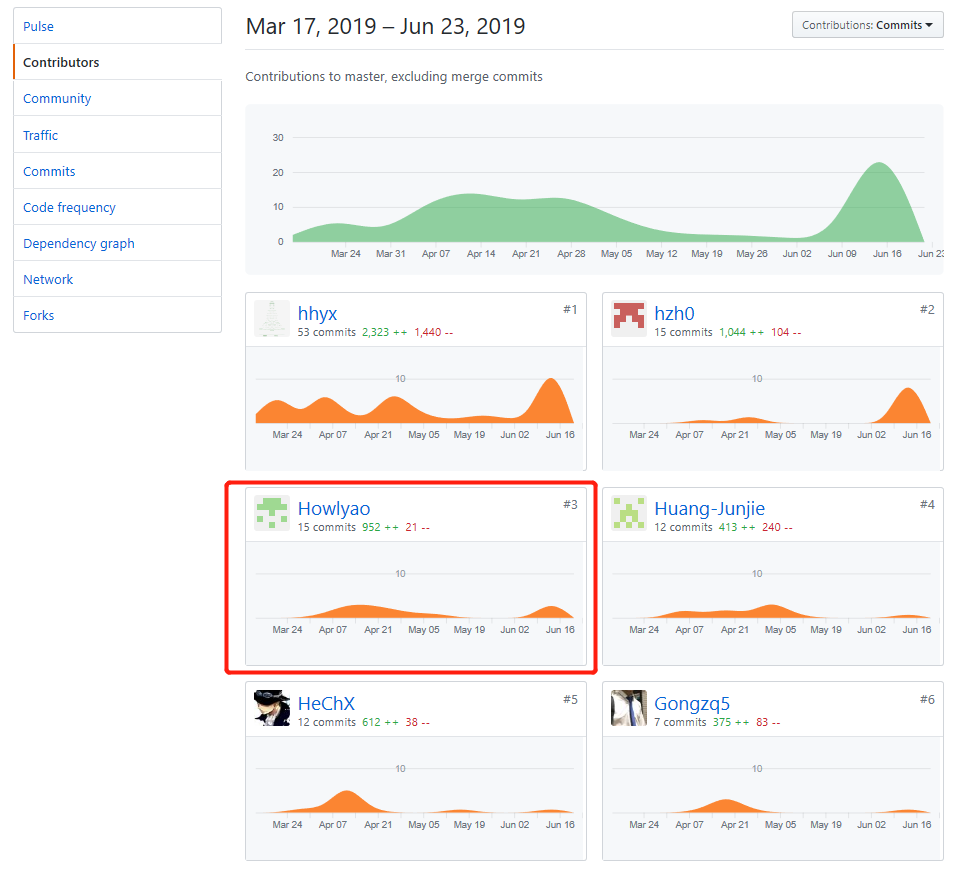
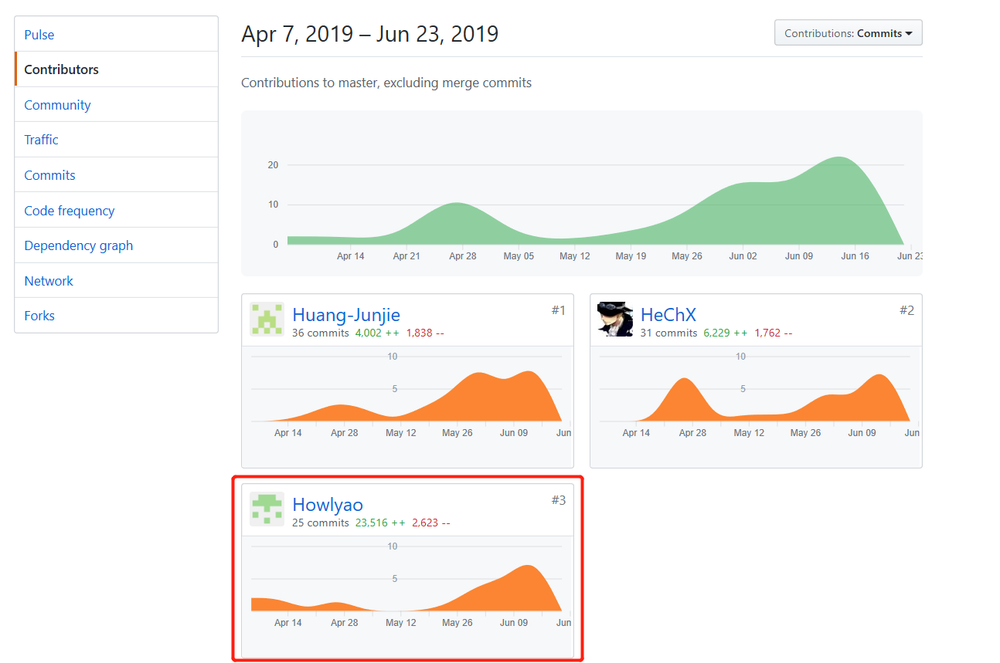

# 16340072 何颢尧
---

## 简短的课程学习自我总结

在这次课程项目负责的工作有实现前端页面跳转的大概框架以及任务管理页面，写关于任务部分的文档如用例图设计，用例于活动图，领域模型，状态模型，功能模型。这是第一次以大团体来做一个项目，之前做项目都是个人或者一些小项目，小团体。所以经验不足，导致出现很多小问题。不过这次累计了经验，之后就不会再犯同样的错误。而这次项目，意识到团体的沟通十分重要，团体的沟通不能局限于开会期间。并且前端成员与后端成员的工作是相互联系，两者可以互相给意见，使得项目的实现更加完美。
本次的课程学习，让我了解了整个软件开发生命周期，特别是了解了“分析”和“设计”，以及后期的“测试”。过去的学习更侧重于学习“开发”和计算机的一些基础的理论的知识，而系分课程让我了解了开发一个软件绝不仅仅是打代码。
前期的分析设计，各种文档的编写、画各种UML图，让我知道一个软件的每一个细节的设计都是需要考虑很多东西的，学会了如何站在用户的角度，来决定一个需求是要保留还是删除，以及要以提升用户体验为目标来决定需求。
同时，此次的项目分工也是大学以来最明确最贴近真正项目开发的，也让我提前感受了一下真正的项目管理合作。
这次项目，我深入了解vue.js代码的编写，以及各种现有的UI库，让编写前端不用自己写样式，而却拥有漂亮的视图。

### PSP 2.1 统计表

 
PSP2.1       | Personal Software Process Stages| Time (%) Senior Student |
------------ | ------------------------------- | ----------------------- |
**Planning** | **计划** | 7 |
Estimate  | 估计这个任务需要多少时间 | 7 |
**Development**  | **开发** |  85 |
Analysis   | 需求分析 (包括学习新技术) | 19 |
Design Spec| 生成设计文档 | 6 |
Design Review| 设计复审 (和同事审核设计文档)| 5 |
Coding Standard| 代码规范 (为目前的开发制定合适的规范)| 4 |
Design|具体设计| 15 |
Coding|具体编码| 26 |
Code Review| 代码复审| 0 |
Test|测试（自我测试，修改代码，提交修改）| 10 |
**Reporting** | **报告** | 8 |
Test Report | 测试报告 | 0 |
Size Measurement | 计算工作量 | 2 |
Postmortem & Process Improvement Plan| 事后总结, 并提出过程改进计划 | 6 |

### 个人分支的 GIT 统计报告
DashBoard文档

Happy-Spare-Money-Frontend前端

## 工作清单
前端整体架构搭建

前端部分页面UI实现：主页面，任务管理页面

前后端部分功能对接：搜索任务获取任务列表，接受任务，放弃任务，取消任务，完成任务，审核任务，发布任务

后端API测试：任务管理部分API

## 技术博客

- [Vue 跨域问题和前后端分离](https://www.jianshu.com/p/712a327e4d84)
- [Vue 页面刷新](https://blog.csdn.net/zjl199303/article/details/82655635)