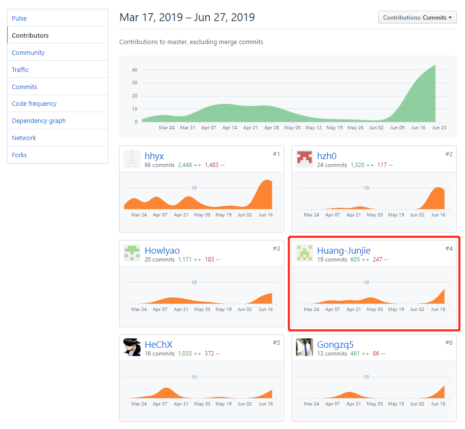
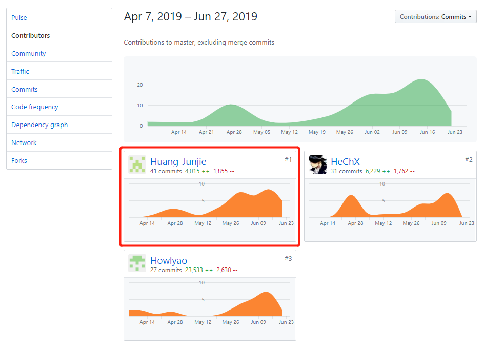

# 16340081 Huang-Junjie Final Report

## 个人简短小结

我主要负责的是用户和机构模块的前端开发，并与小组成员一起开会讨论分析项目的需求和设计。下面分项介绍我在项目完成的内容。

- 编写了用户管理模块的用例、用例图、活动图等；
- 完成了用户和机构管理部分的UI设计、页面实现与api调用；
- 协助后端使用koa-cors实现跨域请求；
- 协助后端使用koa-session2实现会话管理。

## PSP2.1 统计

| PSP2.1                                | Personal Software Process Stages | Time (%) |
| :------------------------------------ | :------------------------------- | -------- |
| **Planning**                          | **计划**                         | 7        |
| Estimate                              | 预估任务时间                     | 7        |
| **Development**                       | **开发**                         | 85       |
| Analysis                              | 需求分析                         | 10       |
| Design Spec                           | 生成设计文档                     | 8        |
| Design Review                         | 设计复审                         | 4        |
| Coding Standard                       | 代码规范                         | 4        |
| Design                                | 具体设计                         | 15       |
| Coding                                | 具体编码                         | 26       |
| Code Review                           | 代码复审                         | 5        |
| Test                                  | 测试                             | 10       |
| **Reporting**                         | **报告**                         | 7        |
| Test Report                           | 测试报告                         | 0        |
| Size Measurement                      | 计算工作量                       | 2        |
| Postmortem & Process Improvement Plan | 事后总结, 并提出过程改进计划     | 6        |

## 主要工作清单

- 实现用户和机构部分的页面：注册/登录页面、个人信息页面、用户信息与任务历史页面、机构搜索与机构列表页面等。
- 深入理解 cookie 和 session 机制，并对 koa-session2 源码进行分析，总结出合理使用 koa-session2 的方法，实现了会话管理。

## 在项目相关仓库中的贡献

**Dashboard** 

**前端** 

## 个人博客清单

- [koa-session2源码分析与使用方法](https://huang-junjie.github.io/2019/05/28/koa-session2源码分析与使用方法/)

## 特别致谢

- **16340070-hzh0** 作为后端工程师，与我共同完成用户和机构系统。对于我前端需要的api，能及时的实现；对于因需求更改或者测试出bug而需要修改的api，能够不厌烦的修改。与其合作十分愉快。

- **小组全体成员** 感谢大家的一起努力合作完成整个项目。

  