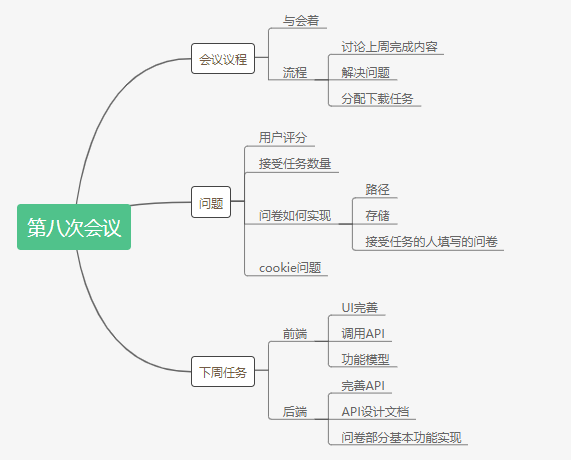
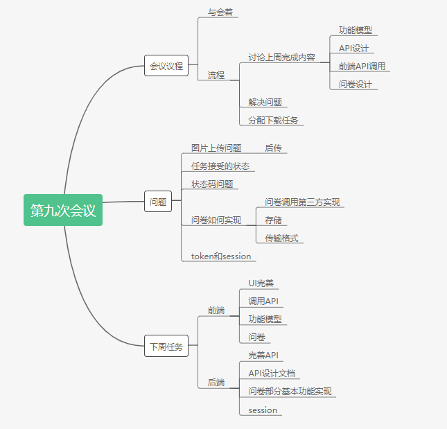

# 第二次迭代会议

## Week8 - 2019/4/16

**会议目标**：细化分工，细化功能设计的问题

**会议时间**： 2019年4月16日

**会议人员**： 韩宇潇、何颢尧、韩智慧、何昶兴、巩泽群、黄俊杰

**会议时间**： 1.3小时

**会议结果**：

- 细化分工，按照任务、小组、用户，对每个人进行分工
- 细化功能设计的问题，在数据库上增加两个表

**本周目标**：

- 后端：
  - 实现API功能
  - 完善API设计文档

- 前端：
  - 基本API设计
  - 完善用例活动图，领域模型
  - 完善UI

----

## Week9 - 2019/4/23

**会议目标**：解决问题，

**会议时间**： 2019年4月23日

**会议人员**： 韩宇潇、何颢尧、韩智慧、何昶兴、巩泽群、黄俊杰

**会议时间**： 1小时15分钟

**上周任务汇报：**

1. huang-junjue：

   API需求已完成，UI完善，use-case完善6-01，6-02部分，领域模型待完成

2. hchx：

   API需求已完成，UI完善，领域模型完成

3. howlyao：

   API需求已完成，UI完善，领域模型完成

4. hyx：

   API设计文档完成，API接口实现完成

5. hzh0：

   API设计文档完成，API接口基本实现

   > 需求貌似不明确，还待考虑

6. Gongzq5：

   API设计文档完成，API接口实现未完成

**本周讨论：**

* **需求讨论**
  1. 获得用户信息
  2. 根据用户查询任务
  3. 头像部分，默认头像的设计

* **实现**  

  1. 后端的SESSION、Cookie部分
  2. 图片的存储，逻辑

**下周任务讨论**

1. 整理API文档，汇总
2. Huang-Junjie 增加User部分的API文档需求
3. 前端做一个可以跳来跳去的页面
4. 后端实现API，静态文件服务器

**Further Feature：**

- 拉黑
  - 用户拉黑其他用户，**举报** 之类的什么东西，点在头像上
- 由上 -> 根据人的搜索
- 评论系统

**今日总结**

恭喜我们已经是个成熟的小组了

----

## Week10 - 2019/4/30

**会议目标**：解决问题，

**会议时间**： 2019年4月30日

**会议人员**： 韩宇潇、何颢尧、韩智慧、何昶兴、巩泽群、黄俊杰

**会议时间**： 1小时15分钟

**上周任务汇报：**

1. Huang-Junjue：

   API需求继续完善，UI继续完善，领域模型待黑没有完成

2. HeChx：

   UI完善

3. Howlyao：

   UI完善

4. hhyx：

   API设计文档完成小组部分，实现静态文件服务

5. hzh0：

   用户API接口基本实现

6. Gongzq5：

   任务API接口实现

**下周任务讨论**

1. 整理API文档，汇总，添加了一些新的用户部分API
2. 前端进行合并
3. 后端进行合并

----

## Week11 - 2019/5/7

**会议目标**：解决问题

**会议时间**： 2019年5月7日

**会议人员**： 韩宇潇、何颢尧、韩智慧、何昶兴、巩泽群、黄俊杰

**会议时间**： 1小时15分钟

**会议记录**

----

## Week12 - 2019/5/14

**会议目标**：解决问题

**会议时间**： 2019年5月14日

**会议人员**： 韩宇潇、何颢尧、韩智慧、何昶兴、巩泽群、黄俊杰

**会议时间**： 1小时

**会议记录**

