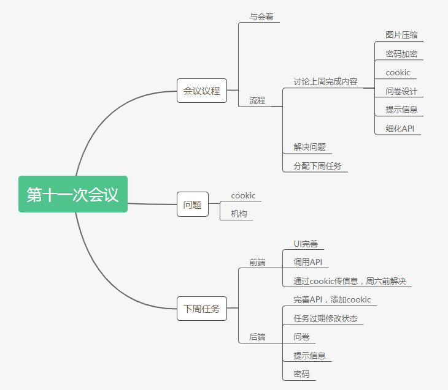

# 第三次迭代会议

## Week13 - 2019/5/21

**会议目标**：解决问题

**会议时间**： 2019年5月21日

**会议人员**： 韩宇潇、何颢尧、韩智慧、何昶兴、巩泽群、黄俊杰

**会议时间**： 1.5小时

**会议记录**

----

## Week14 - 2019/5/28

**会议目标**：解决问题

**会议时间**： 2019年5月28日

**会议人员**： 韩宇潇、何颢尧、韩智慧、何昶兴、巩泽群、黄俊杰

**会议时间**： 1小时

**会议记录**

----

## Week15 - 2019/6/4

**会议目标**：解决问题

**会议时间**： 2019年6月4日

**会议人员**： 韩宇潇、何颢尧、韩智慧、何昶兴、巩泽群、黄俊杰

**会议时间**： 1.5小时

**会议记录**

----

## Week16 - 2019/6/11

**会议目标**：解决问题

**会议时间**： 2019年6月11日

**会议人员**： 韩宇潇、何颢尧、韩智慧、何昶兴、巩泽群、黄俊杰

**会议时间**： 1.5小时

**会议记录**

----

## Week17 - 2019/6/18

**会议目标**：解决问题

**会议时间**： 2019年6月18日

**会议人员**： 韩宇潇、何颢尧、韩智慧、何昶兴、巩泽群、黄俊杰

**会议时间**： 1.5小时

**会议记录**：

**会议总结**：项目就快要完工了，最后改一些小问题，完善文档就可以顺利结束了