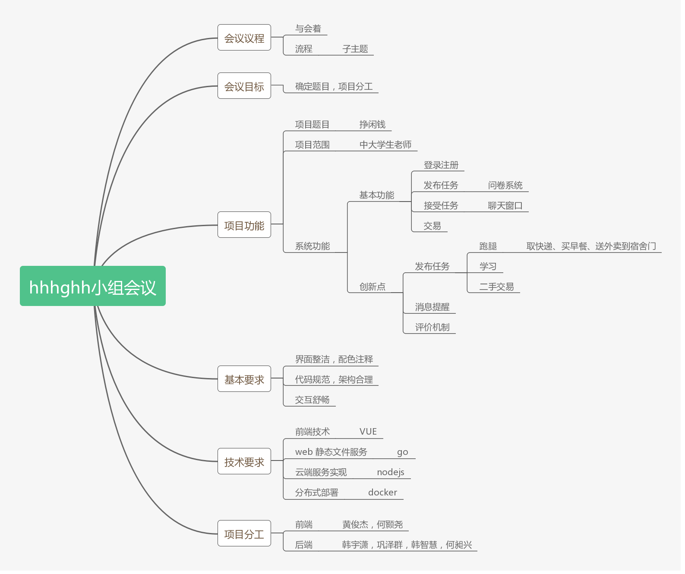
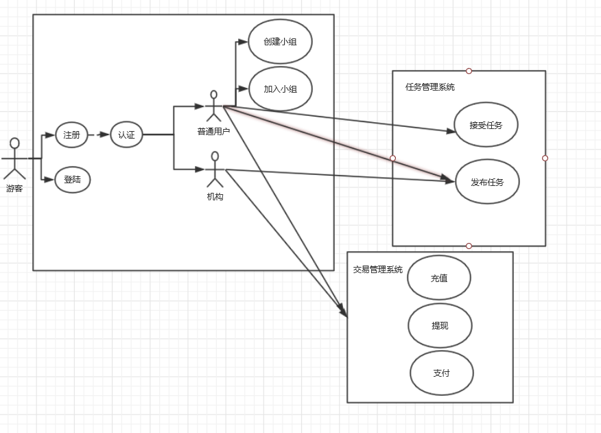
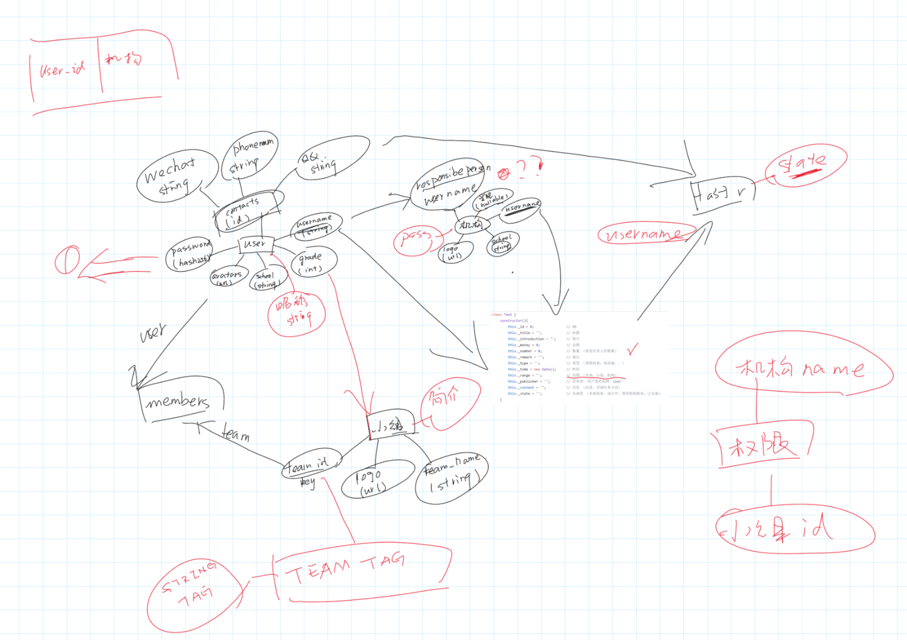

# Week4  - 2019/3/19

**会议目标**： 确定项目的功能以及项目分工

**会议时间**： 2019年3月19日

**会议人员**： 韩宇潇、何颢尧、韩智慧、何昶兴、巩泽群、黄俊杰

**会议时间**： 1.5小时

**会议结果**：

**本周目标**：学习框架的使用，配置开发环境，思考项目的需求

---

# Week5 - 2019/3/26

**会议目标**： 确定项目的具体功能以及功能实现

**会议时间**： 2019年3月26日

**会议人员**： 韩宇潇、何颢尧、韩智慧、何昶兴、巩泽群、黄俊杰

**会议时间**： 2小时

**会议结果**：基本定义项目所需实现的功能，画出 Usecase Diagram

- 用例图第一版：

**本周目标**：

 - 前端： 
    - 初步的UI设计 
    - 基本的API设计
 - 后端：
   - 细化前端的设计 
   - 数据库，给出初步的ER图 
   - 模块分解，给出初步的模块间的接口设计

---

# Week6 - 2019/4/2

**会议目标**：细化项目的数据库设计，细化功能设计

**会议时间**： 2019年4月2日

**会议人员**： 韩宇潇、何颢尧、韩智慧、何昶兴、巩泽群、黄俊杰

**会议时间**： 2小时

**会议结果**：细化数据库设计，在原数据库基础上增加了多个表，明确了数据库表间的联系。讨论具体内容的实现，例如对机构进行设计。

- 机构：（只能向有权限的小组发任务）
    - 有几个公共的小组（大一，大二，大三。。）
    - 机构自己建立一个小组（类似公众号）
    - 可以向小组发申请，经过同意，可以向小组发任务
- 设计数据库草图

**本周目标**：

- 后端团队：
    -  完善数据库
    -  用户及权限系统数据库设计
    -  数据库ER模型图
    - 项目前期调研/竞品分析， 项目愿景， 团队组建与分工

- 前端团队：
    - 页面跳转图，
    - 用例图，
    - 设计UI
    - Use Cases 用例+活动图

---

# Week7 - 2019/4/9

**会议目标**：细化功能设计，对上周设计的用例图，用例+活动图，页面跳转图进行进一步分析

**会议时间**： 2019年4月9日

**会议人员**： 韩宇潇、何颢尧、韩智慧、何昶兴、巩泽群、黄俊杰

**会议时间**： 1.5小时

**会议结果**：细化功能设计，经过会议讨论完善了各种设计的问题。

- 细化用户部分用例图：取消管理员，增加邀请用户功能，修改认证和验证后的跳转界面
- 细化任务部分用例图：预支付，取消任务的解决方案（接受任务的人取消，发布任务的人取消），任务超时）处理（发任务的人两确认方式）
- 细化界面跳转图，添加机构部分

**本周目标**：

- 后端：
  - 文档完善		hzh0，hhyx
  - 数据库连接	GZQ
  - 数据库增删改查	hzh0（用户），hhyx（任务）

- 前端：
  - 文档完善		HeChX，Huang-Junjie，Howlyao
  - 网页设计         HeChX（小组管理），Huang-Junjie（登录，注册），Howlyao（任务）

---

# Week8 - 2019/4/16

**会议目标**：细化分工，细化功能设计的问题

**会议时间**： 2019年4月16日

**会议人员**： 韩宇潇、何颢尧、韩智慧、何昶兴、巩泽群、黄俊杰

**会议时间**： 1.3小时

**会议结果**：

- 细化分工，按照任务、小组、用户，对每个人进行分工
- 细化功能设计的问题，在数据库上增加两个表

**本周目标**：

- 后端：
  - 实现API功能
  - 完善API设计文档

- 前端：
  - 基本API设计
  - 完善用例活动图，领域模型
  - 完善UI