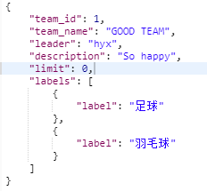
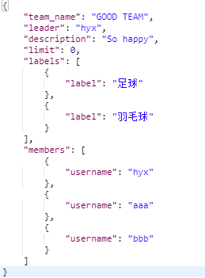

http://localhost:3000/api/team/

# 小组搜索页面

1. ```getGroupByGroupName(group.name)```: 根据组名来查找小组 

    GET: /team/?team_name={:team_name}
    
    200 成功，412 异常， 413 没有小组
    
    返回格式
    
      
      
      

2. ```getGroupByGroupId(group.id)```: 根据小组id来查找小组 

     GET: /team/?team_id={:team_id}
     
     200 成功，412 异常，413 没有小组
     
     返回格式
     
      
      
      

3. ```getGroupByTag(tag)```: 根据标签来查找小组

     GET: /team/?tag={:tag}
     
     200 成功，412 异常
     
     返回格式
     
      
      
      
      
      

4. ```applyToJoinGroup(user.id, group.id)```: 用户申请进组，判断小组的进组权限，直接进组/需要组长审核/禁止加入

     PATCH: /teamMembers/?team_id={:team_id}&username={:username}
     
     200 成功，412 异常，413 需要组长审核，414 不允许添加

# 我的小组页面
1. ```getGroupByUsername(user.username)```: 根据用户名返回用户加入了的小组的所有信息 

    GET: /team/?member_username={:member_username}
    
    200 成功，412 异常
    
2. ```getMembersByGroupId(group.id)```: 根据小组id来得到小组成员 

    GET: /team/?group_id={:group_id}
    
    200 成功，412 异常
    
3. ```isGroupLeader(group.id, user.username)```: 返回用户是否是该小组组长  

    GET: /team/?team_id={:team_id}&leader={:leader}
    
    200 成功是组长，412 异常， 413 不是组长

    3'.    ```isGroupMember(group.id, user.username)```: 返回用户是否是该小组成员 
    
    GET: /team/?team_id={:team_id}&member_username={:member_username}
    
    200 成功是成员，412 异常， 413 不是成员
    
4. ```disbandGroup(group.id, user.username)```: 判断该用户是否是小组的组长，是则解散小组，返回小组解散成功    先调用3判断，调用4删除

   DELETE: /team/?team_id={:team_id}&leader={:leader}
   
    200 成功，412 异常，413 组长不正确
    
    还缺少删除小组相关任务部分
    
5. ```removeMemberFromGroup(group.id, group_leader.username, member.username)```: 判断group_leader是否是这个小组的组长以及判断被踢成员是否在组里，若在，则踢出小组，返回踢出成功 

    DELETE: /team/?team_id={:team_id}&leader={:leader}&username={:username}
    
    200 成功，412 异常，413 组长不正确， 414 不能删除组长，415 小组没有该用户
    
6. ```transferGroup(group.id, group_leader.id, member.id)```: 判断group_leader是否是这个小组的组长以及判断被踢成员是否在组里，是则将小组转让，group_leader变成小组普通成员，member变成组长      调用3’判断成员，调用6修改组长 

    PATCH: /teamLeader/?team_id={:team_id}&leader={:leader}&username={:username}
    
    200 成功，412 异常，413 组长不正确，414 成员不正确
    
7. ```withdrawGroup(group.id, user.username)```: 判断该用户是否是小组成员，如果是，则退出小组，返回成功     调用删除成员 

    DELETE: /team/?team_id={:team_id}&username={:username}
    
    200 成功，412 异常，413 成员不正确，414 组长不能退出，415 该小组不存在
    
8. ```inviteUserToGroup(group.id, member.id, user.username)```: 判断小组的进组权限（是否需要验证）以及user是否存在，若不需要验证，则添加user到小组成员；若需要验证，则判断member是否为组长，是则添加，否则向组长发送验证通知      先获取权限，组长，在添加成员 

    PATCH: /teamMembers/?team_id={:team_id}&leader={:leader}&username={:username}
    
    200 成功，412 异常，413 需要组长验证,414 不允许添加
    
9. ```modifyGroupInformation(group, group_leader.id)```: 判断是否是组长，若是则修改小组信息

PUT: /modifyTeam/

200 成功，412 异常，413 组长不存在/小组不存在，414 组长不正确

上传格式



# 创建小组页面
1. ```createGroup(group, creator.id, vector<user.username>)```: 创建小组，creator为组长，vector中的user为小组成员（如果isUserExisted没有实现，这里需要逐个判断用户是否存在）

上传格式



POST: /createTeam/ 

200 成功，412 异常, 413 组长不存在，414 部分成员不存在，416 参数不齐全


# 未完待续......
