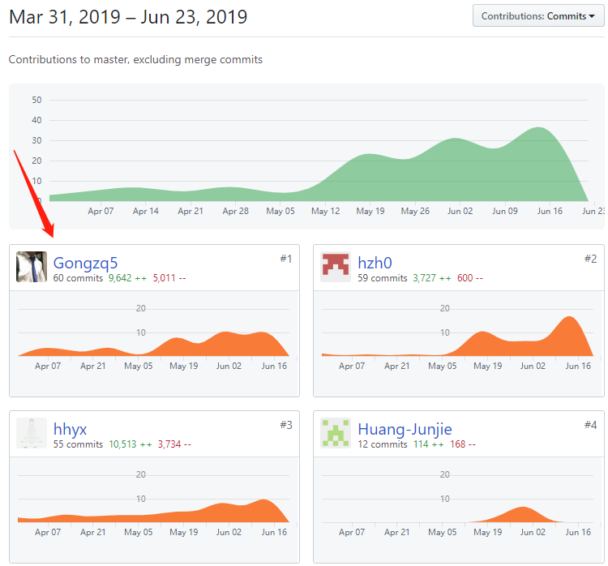
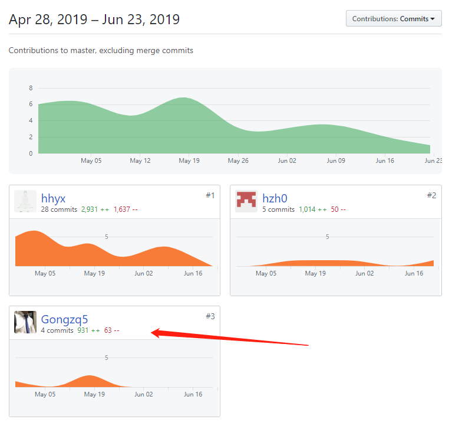
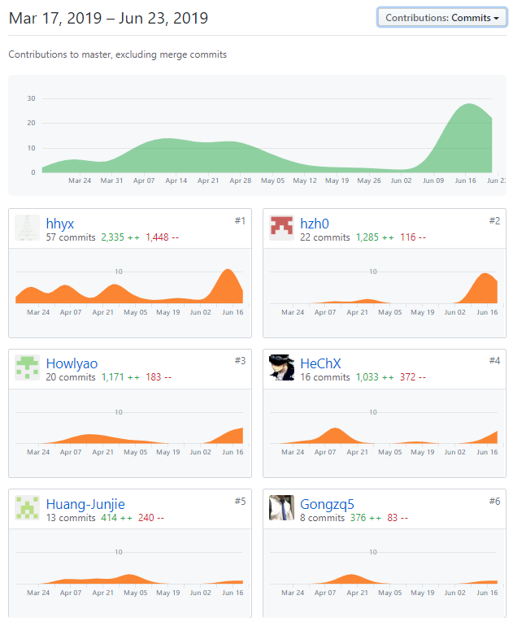

# Final Report

*16340063 @Gongzq5*

## 个人简短总结

主要是做后端的内容，前端没有碰，主要做的工作有

* 前期的 数据库的分析和建表，确定后端的技术栈（Nodejs+KOA2+Sequelize）
* 中期的 后端API源代码的编写（任务部分），API文档的编写（任务部分）
* 以及后期的 代码部署的工作

想了想本次的课程项目，非常大头的时间花在了需求的分析上。在需求分析阶段，我们小组的几个人连续开了两三周的会进行讨论，几个人偶尔会为了一个需求争来争去，就是为了讨论它是否是一个必需实现的功能，感觉这个阶段是以往会忽略的，但是这个阶段的工作会指导一个稍大一点的软件的整个开发过程，以后每次确定业务逻辑时都要根据这个需求分析的指导来确定具体的写法。这次的开发是大学里真正贴近实际项目开发的一次，感觉之前的都是自己的小打小闹，哪怕是团队开发也是用个人开发的方法。而这次则是真正体会到了团队协作的魅力。

这次感觉到非常重要的有几点，一是团队的分工，将任务尽量的分解为正交的几个部分，每个人都不会和别人有太大的耦合，使得项目可以多人同步协作，而不是互相等待，这是非常重要的。我们把项目大致的分为了三个部分，任务的处理（发布、接受、完成……）、用户（信息的注册、更新、认证……）、小组（注册、加入、推出……），前端和后端都基于这样的划分，基本上实现了所谈的正交。二是要有一个推动项目前进的人，在我们的小组中主要是@hhyx，也可以说是每周固定时间开会的结果，每周固定开会，使得项目每周都必须完成新的内容，稳步地推进了项目的前进，这是非常重要的，也是可以按时完成的重点。

## PSP 2.1 统计

| PSP阶段                    | 耗时(h) |
| -------------------------- | ------- |
| **计划**                   | 4       |
| · 估计任务时间             | 4       |
| **开发**                   | 56      |
| · 分析需求                 | 5       |
| · 生成设计文档             | 3       |
| · 设计复审                 | 2       |
| · 代码规范                 | 1       |
| · 具体设计                 | 3       |
| · 具体编码                 | 30      |
| · 代码复审                 | 2       |
| · 测试                     | 10      |
| **报告**                   | 5       |
| ·测试报告                  | 1       |
| ·计算工作量                | 1       |
| 事后总结，提出过程改进计划 | 3       |
| 合计                       | 65      |

## 主要工作清单（劳苦清单）

后端和任务有关部分的API，然后是写API文档（这个真的写的难受啊……），最后摸索了半天的部署（终于发现很简单:）简单到不需要思考）

## Git统计

### 后端仓库

### API 文档仓库

> API文档是基于swagger的

### Dashboard 仓库

## 个人博客清单

* [Sequelize框架的使用](https://gongzq5.github.io/posts/Use-sequelize-ORM-in-Nodejs-2019-06-23/)

## 特别致谢

**主要主要主要** 要谢谢每个小组成员吧，每个人都是不可或缺的部分。

特别要感谢和我对接的前端大佬 [@Howlyao](<https://github.com/Howlyao>)，很耐心的一直在等我填我写的API的坑，感觉拖累了大佬的脚步；

除了组内的成员可能也没有什么太需要感谢的人了，或许需要感谢一下写Sequelize文档的不知名大佬[@demopark](<https://github.com/demopark/sequelize-docs-Zh-CN>)，哈哈。