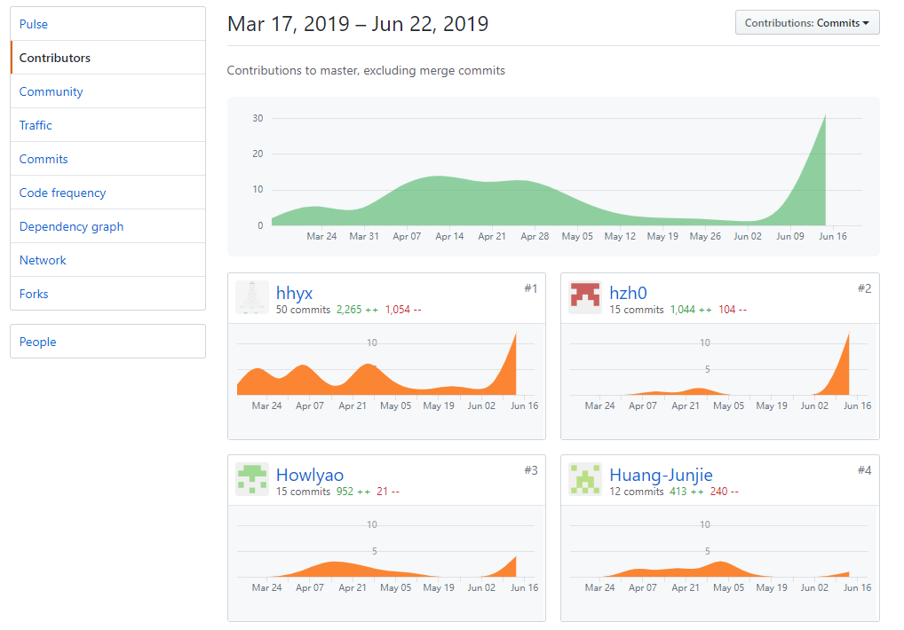
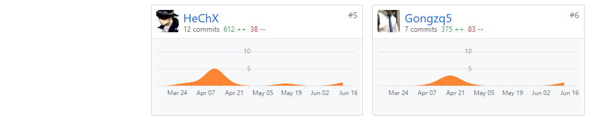
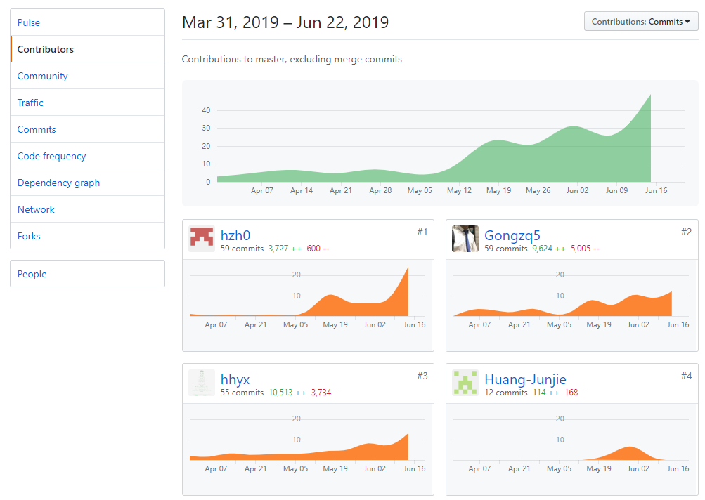
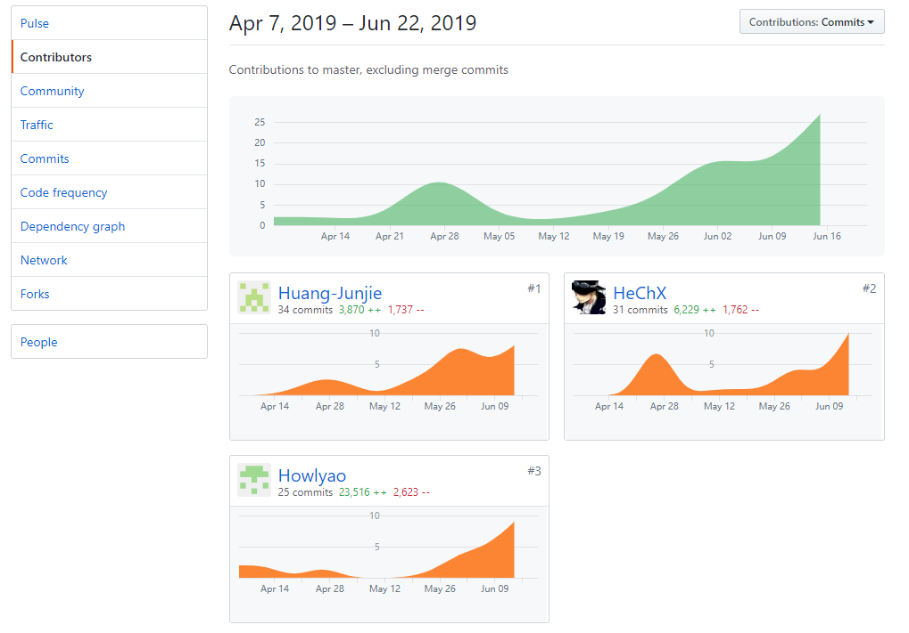
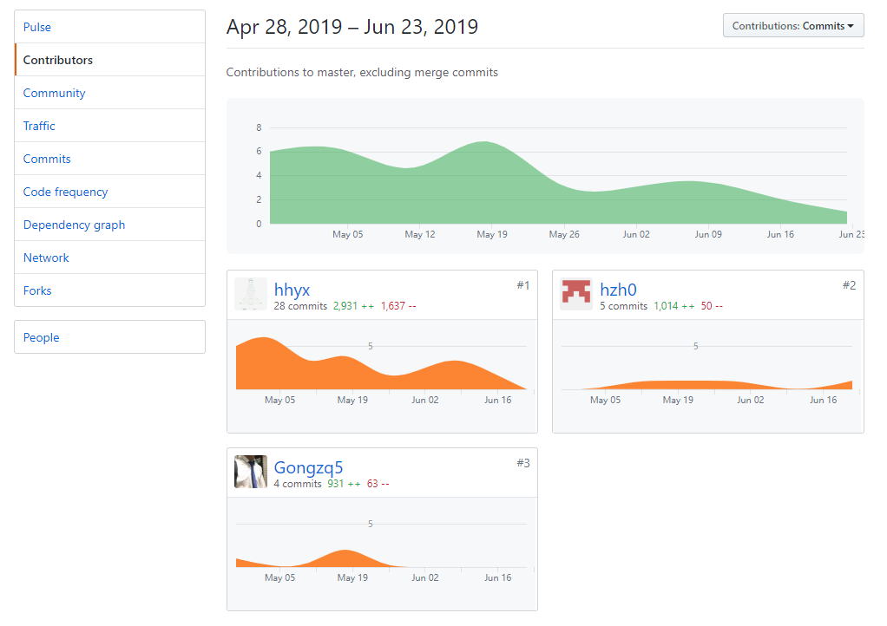

# 小组总结

### 小组分工与贡献率说明

|            | hhyx | Gongzq5 | hzh0 | HeChX | Huang-Junjie | Howlyao |
| ---------- | ---- | ------- | ---- | ----- | ------------ | ------- |
| 后端       | 35%  | 34%     | 30%  | 0%    | 1%           | 0%      |
| 前端       | 0%   | 0%      | 0%   | 30%   | 30%          | 40%     |
| 需求规格   | 12%  | 13%     | 14%  | 21%   | 20%          | 20%     |
| 分析与设计 | 16%  | 16%     | 16%  | 17%   | 17%          | 18%     |

### 项目所有仓库贡献图表截图
**Dashboard**

**后端**

**前端**

**API文档**
