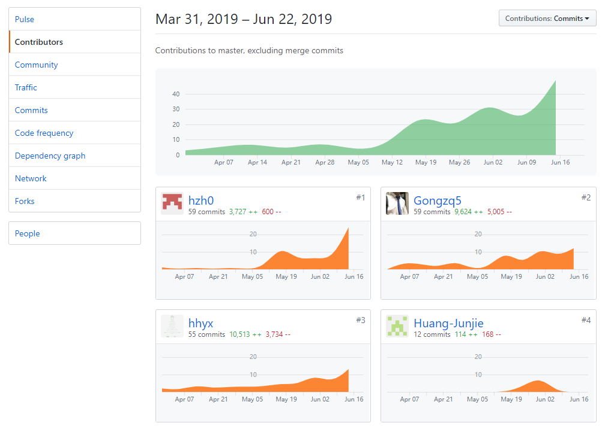
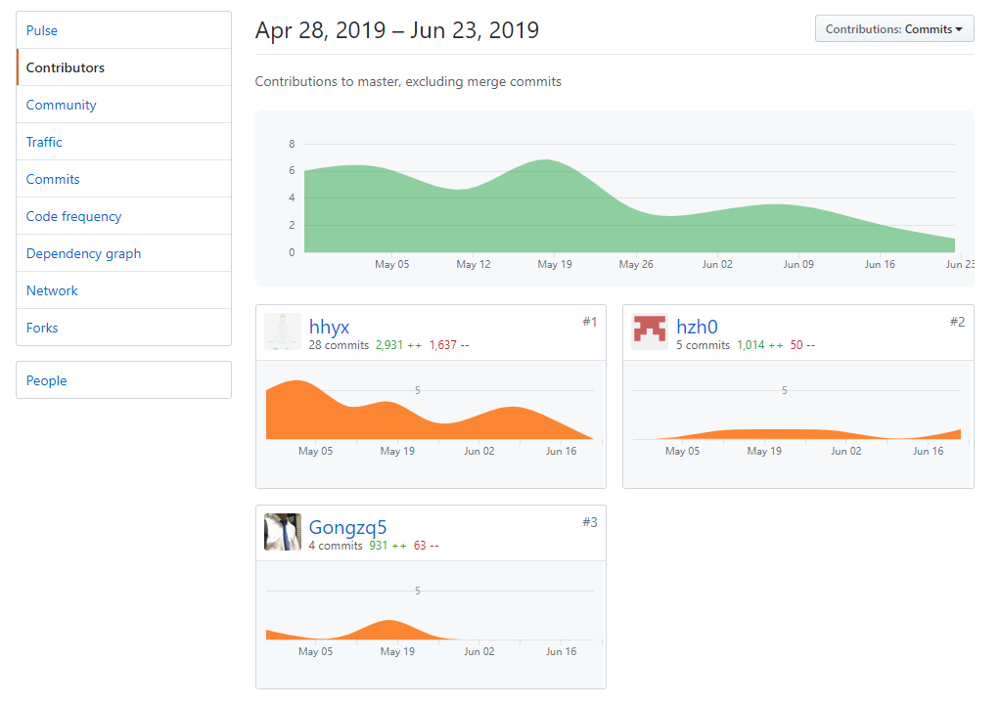

# 小组总结

### 小组分工与贡献率

| 学号 | 姓名 | 具体分工 |贡献率|
| ---- | ---- | ---- |----|
| 16340069 | hhyx | 完成项目后端的小组子系统的相关部分的设计 |17%|
| 16340063 | Gongzq5 | 完成项目后端的任务子系统的相关部分的设计，完成项目的数据的设计 |17%|
| 16340081 | Huang-Junjie | 完成前端用户部分页面的设计 |17%|
| 16340072 | Howlyao | 完成前端任务部分页面的设计 |17%|
| 16340070 | hzh0 | 完成项目后端的用户子系统的相关部分的设计 |16%|
| 16340071 | HeChX | 完成前端小组部分页面的设计 |16%|

### 制品与贡献率

|            | hhyx | Gongzq5 | hzh0 | HeChX | Huang-Junjie | Howlyao |
| ---------- | ---- | ------- | ---- | ----- | ------------ | ------- |
| 后端       | 35%  | 34%     | 30%  | 0%    | 1%           | 0%      |
| 前端       | 0%   | 0%      | 0%   | 30%   | 30%          | 40%     |
| SRS   | 17%  | 16%     | 16%  | 17%  | 17%         | 17%    |
| SDS  | 40% |  0%    | 30% |   0% |     30%     |    0%     |

### 项目所有仓库贡献图表截图
**Dashboard**

**后端**

**前端**

**API文档**

